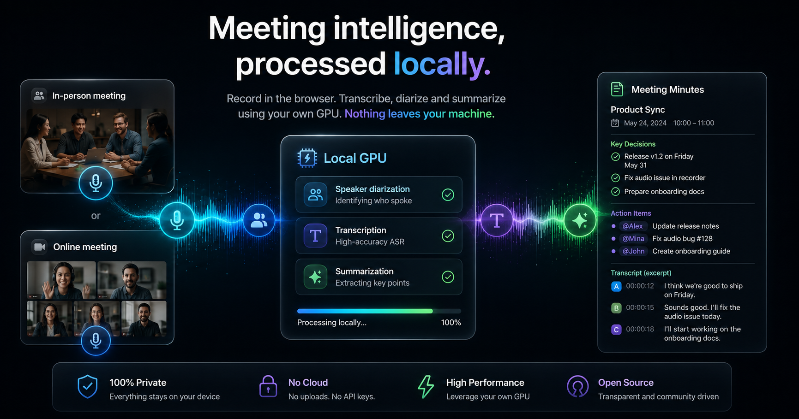
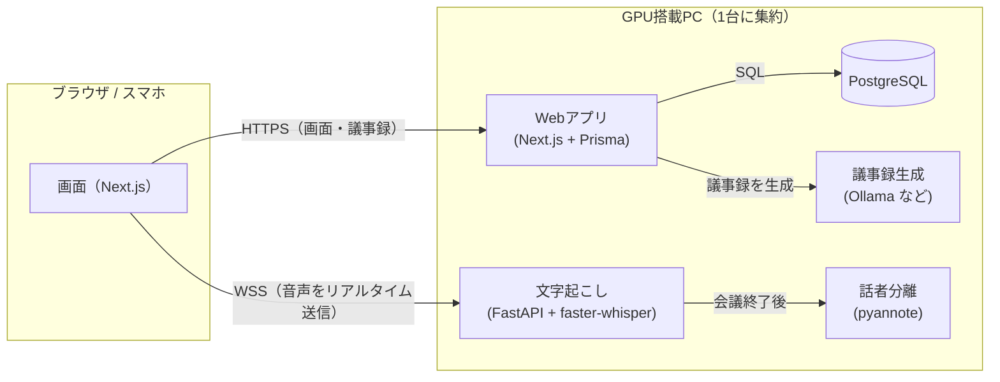

# Voxinq Meeting — 日本語ガイド

> 会議を録音して、**文字起こしから議事録作成まで全部自分のPCのGPUで完結**させるアプリです。
> 音声も議事録もクラウドに送信しません。

[English README](README.md) ｜ このページは日本語話者向けに、導入から日常運用までを順番に説明します。



---

## 目次

1. [何ができるアプリか](#1-何ができるアプリか)
2. [こんな人におすすめ](#2-こんな人におすすめ)
3. [必要なもの（動作環境）](#3-必要なもの動作環境)
4. [インストール手順](#4-インストール手順)
5. [基本的な使い方](#5-基本的な使い方)
6. [便利な機能](#6-便利な機能)
7. [スマホから使う（Tailscale）](#7-スマホから使うtailscale)
8. [設定のカスタマイズ](#8-設定のカスタマイズ)
9. [よくある質問（FAQ）](#9-よくある質問faq)
10. [困ったときは](#10-困ったときは)
11. [仕組み（技術的な話）](#11-仕組み技術的な話)
12. [ライセンス](#12-ライセンス)

---

## 1. 何ができるアプリか

ブラウザで会議を録音すると、次の3つが**すべてローカルのGPU**で自動的に行われます。

| ステップ | 使う技術 | 内容 |
| --- | --- | --- |
| ① 文字起こし | faster-whisper | 話しながらリアルタイムで文字が出ます |
| ② 話者分離 | pyannote | 「誰が話したか」を会議後に自動で振り分けます |
| ③ 議事録作成 | ローカルLLM（Ollama など） | 要約・決定事項・TODO を自動生成します |

**外部APIを一切使わない構成で動きます。** APIキーも、月額料金も不要です。
（希望すれば Anthropic や OpenAI などクラウドのLLMに切り替えることもできます。）

## 2. こんな人におすすめ

- **会議の内容を外部に出せない方** — 研究・法務・人事・経営戦略など、クラウドの文字起こしサービスに音声をアップロードできない場面で使えます
- **議事録作成に時間を取られている方** — 会議終了と同時に議事録の生成が始まります
- **手元にゲーミングPCがある方** — VRAM 8GB のGPUがあれば十分動きます
- **月額課金を避けたい方** — 自分のPCで動くので、何時間録音しても無料です

逆に、GPUを積んだPCを常時起動しておけない場合は、クラウドサービスの方が手軽です。

## 3. 必要なもの（動作環境）

### ハードウェア

| 項目 | 必要なもの | 補足 |
| --- | --- | --- |
| GPU | **NVIDIA製・VRAM 8GB以上** | RTX 3060/4060 クラスで動作します。CUDA対応が必須です |
| メモリ | 16GB以上を推奨 | |
| ストレージ | 10GB程度の空き | AIモデルのダウンロードに使います |
| OS | Windows / Linux | 開発・動作確認は Windows 11 で行っています |

> **VRAM 8GB でも動く工夫**
> 文字起こし用のWhisperと議事録用のLLMは同時にVRAMへ載りません。そこで
> **「会議中はWhisper、会議が終わったらLLM」と時間で切り替える**設計にしています。
> そのため8GBでも問題なく動作します。

### ソフトウェア

インストール前に以下を用意してください。

- [Node.js](https://nodejs.org) 20以上
- [Python](https://www.python.org) 3.11
- [PostgreSQL](https://www.postgresql.org) 17
- [Ollama](https://ollama.com)（ローカルLLM実行環境）

## 4. インストール手順

### ステップ1: リポジトリを取得

```bash
git clone https://github.com/ikasast/voxinq-meeting.git
cd voxinq-meeting
```

### ステップ2: セットアップスクリプトを実行

必要なものを自動で判定してインストールします。**何度実行しても安全**です。

```powershell
# Windows の場合
.\scripts\setup.ps1
```

```bash
# Linux / macOS の場合
./scripts/setup.sh
```

このスクリプトは次のことを順番に行います。

1. 必要なソフトが入っているかチェック（不足していれば教えてくれます）
2. `npm install` で依存パッケージを導入
3. `.env` を作成し、**PostgreSQLの接続情報を対話形式で質問**します
4. データベースのテーブルを作成
5. 文字起こしサービス用のPython環境を構築
6. 議事録用のAIモデル（`qwen2.5:7b-instruct`）をダウンロード

> **最初に入るAIモデルについて**
> `qwen2.5:7b-instruct` は「**VRAM 8GBでも確実に動く**」ことを優先して選んだ初期設定です。
> 性能上の最適解ではないので、GPUに余裕があれば
> [もっと高性能なAIを使いたい場合](#もっと高性能なaiを使いたい場合) を参考に、
> あとから好きなモデルへ差し替えられます（Ollamaならコマンド1つです）。

> **話者分離（誰が話したかの判別）も使う場合**
> `--diarization`（Windowsは `-Diarization`）を付けて実行してください。
> ```powershell
> .\scripts\setup.ps1 -Diarization
> ```
> 加えて、Hugging Face で以下2つのモデルの利用規約に同意し、`HF_TOKEN` を設定する必要があります。
> - [pyannote/speaker-diarization-3.1](https://huggingface.co/pyannote/speaker-diarization-3.1)
> - [pyannote/segmentation-3.0](https://huggingface.co/pyannote/segmentation-3.0)

### ステップ3: 起動

```powershell
# Windows の場合
.\scripts\start.ps1
```

```bash
# Linux / macOS の場合
./scripts/start.sh
```

ブラウザで `http://localhost:3000` を開けば準備完了です。

> ⚠️ **開発モード（`npm run dev`）で常用しないでください**
> 他の端末（スマホなど）からアクセスした際に画面が反応しなくなります。
> `scripts/start` は自動的に本番ビルドで起動するので、通常はこれを使ってください。

### PCの起動時に自動で立ち上げたい場合

**Windows** — タスクスケジューラに常駐登録するスクリプトを用意しています。

```powershell
scripts\windows\install-db-task.ps1        # PostgreSQL
scripts\windows\install-web-task.ps1       # Webアプリ
stt-service\install-startup-task.ps1       # 文字起こしサービス
scripts\windows\install-backup-task.ps1    # DBの自動バックアップ（毎晩3時）
```

**Linux** — Webアプリはコード更新時に `scripts/redeploy.sh` で再起動できます。文字起こしサービスは
同梱の systemd ユニットを登録してください。

```bash
sudo cp stt-service/voxinq-stt.service /etc/systemd/system/
sudo systemctl enable --now voxinq-stt
```

詳しい手順は [docs/setup.md](docs/setup.md)（英語）にあります。

## 5. 基本的な使い方

### 会議を録音して議事録を作る

1. **「+ New」** をクリックして会議を作成します
   - 「Purpose & agenda」に議題を書いておくと議事録の精度が上がります
2. **「Start recording」** で録音開始 — 話した内容がその場で文字になっていきます
3. 会議が終わったら、**終了方法を3つから選びます**

| ボタン | 動作 | こんなときに |
| --- | --- | --- |
| **Generate minutes & end** | 議事録の生成を開始して終了 | 通常はこれでOK |
| **Diarize & end** | 話者分離を実行して終了 | 複数人の会議で「誰の発言か」を先に整理したいとき |
| **End only** | 終了だけ | 後でまとめて処理したいとき |

議事録はバックグラウンドで生成されるので、**画面を閉じても大丈夫**です。

### 既存の録音ファイルから議事録を作る

録音済みのファイルがある場合は、**「New meeting」画面に音声ファイルをドラッグ＆ドロップ**するだけです。
文字起こし → 議事録作成が自動で進みます。（wav / mp3 / m4a などに対応）

## 6. 便利な機能

### 話者を自動で名前付けする（声紋登録）

一度声を登録しておくと、**以降の会議では自動的にその人の名前が付く**ようになります。

**自分の声を登録する場合**
「Settings」→「Speakers」タブ → 名前を入力 → 表示された文章を20〜30秒読み上げるだけです。

**他の参加者を登録する場合**
会議の詳細画面で話者分離を実行 → 各話者に名前を付ける → 「Save voice profiles」を押します。
※ 録音データ（WAV）が残っている会議でのみ可能です（7日で自動削除されるため注意）。

### 定例会議をまとめる（シリーズ機能）

毎週の定例など、継続的な会議は**シリーズ**にまとめられます。

- 一覧では**シリーズが1つに束ねて表示**され、リストがすっきりします
- 議事録を作るとき、**前回の議事録がAIに参考情報として渡される**ので、「前回の続きですが」といった発言も正しく解釈されます
- シリーズごとに**議事録のフォーマットや専門用語集を設定**できます（シリーズ名をクリックすると設定画面が開きます）

### 議事録を作り直す

内容が気に入らない場合、**↻ボタン**から再生成できます。その際に選べるのは:

- **詳細度** — 簡潔（brief）／標準（standard）／詳細（detailed）
- **使用するAI** — Ollama／Anthropic／OpenAI互換

過去のバージョンは残るので、**見比べてから選べます**。

### 整理する（検索・タグ・アーカイブ）

- **検索** — 会議名だけでなく、**発言内容や議事録の中身も検索対象**です
- **タグ** — 会議を分類できます
- **アーカイブ** — 一覧から隠しますが、検索には出てきます。「Archived」ページで一覧できます
- **ゴミ箱** — 削除しても30日間は復元できます

> 📱 **スマホではスワイプ操作が使えます**
> 右にスワイプ → アーカイブ／左にスワイプ → ゴミ箱（Gmailと同じ感覚です）。
> シリーズが束ねられている状態でスワイプすると、**シリーズ全体をまとめて操作**できます。

### 議事録をダウンロードする

会議詳細画面の**⬇ボタン**から、必要なものを選んでダウンロードできます。

- 議事録（.md）
- 発言ログ（.txt）
- 会議情報（.md）— 会議名・日時・参加者・**使用したAIモデルなどの設定情報**
- 録音データ（.wav）

複数選ぶとZIPにまとまります。

## 7. スマホから使う（Tailscale）

外出先や会議室から使うには、[Tailscale](https://tailscale.com) を使うのが簡単です。
（無料で使えるVPNのようなサービスで、自分の端末同士を安全につなぎます）

```bash
tailscale serve --https=443 localhost:3000      # Webアプリ
tailscale serve --https=8443 localhost:8000     # 文字起こしサービス
```

設定後、`.env` の `NEXT_PUBLIC_STT_WS_URL` を Tailscale のアドレスに変更し、**再ビルド**してください。

```
NEXT_PUBLIC_STT_WS_URL="wss://<ホスト名>.<テイルネット名>.ts.net:8443/ws"
```

> ⚠️ この設定は**ビルド時に埋め込まれる**ため、変更したら必ず再ビルドが必要です。

スマホのブラウザで開いたあと「ホーム画面に追加」すると、**アプリのように使えます**（PWA対応）。

> 🔒 **セキュリティに関する注意**
> 文字起こしサービス（8443ポート）は、**Tailscaleの外（Funnel等でインターネット公開）に出さないでください。**
> このサービスには認証がなく、tailnet内での利用を前提としています。

## 8. 設定のカスタマイズ

設定は2か所に分かれています。

### 画面から変更できるもの（`settings.json`）

「Settings」画面で変更でき、**再起動は不要**です。

| タブ | 主な設定 |
| --- | --- |
| Transcription | Whisperのモデル、認識する言語、専門用語（認識精度が上がります）、マイクモード |
| Speakers | 声紋の登録・削除 |
| Minutes | 議事録の言語、詳細度、フォーマット、業務背景情報 |
| LLM | 使用するAI（Ollama / vLLM / LM Studio / Anthropic / OpenAI）、モデル名、APIキー |
| Appearance | ダーク／ライトテーマ |

> **「業務背景情報」が便利です**
> 所属組織や進行中のプロジェクト、よく出る略語などを書いておくと、AIが専門用語を正しく解釈できるようになります。
> ※ここに書いた内容が議事録にそのまま転記されることはありません。

### ファイルで設定するもの（`.env`）

変更したら**再起動（または再ビルド）が必要**です。

| 項目 | 内容 |
| --- | --- |
| `DATABASE_URL` | PostgreSQLの接続先 |
| `NEXT_PUBLIC_STT_WS_URL` | 文字起こしサービスのアドレス（**変更時は再ビルド必須**） |
| `APP_PASSWORD` | パスワード認証（未設定なら認証なし） |

詳細は [docs/configuration.md](docs/configuration.md)（英語）を参照してください。

### もっと高性能なAIを使いたい場合

議事録の品質はAIモデルの性能に大きく左右されます。初期設定の `qwen2.5:7b-instruct` は
**8GBのVRAMで安全に動くこと**を優先した選択なので、**GPUに余裕があれば、より賢いモデルに変えると議事録の質が上がります。**

#### いちばん簡単な方法: Ollamaでモデルを入れ替える

コマンド1つでダウンロードし、「Settings」→「LLM」でモデル名を書き換えるだけです。

```bash
ollama pull qwen3:8b        # 例
```

VRAM別のおすすめは次のとおりです（量子化された既定版を想定した目安）。

| VRAM | おすすめモデル | 特徴 |
| --- | --- | --- |
| 8GB | `qwen2.5:7b-instruct`（初期設定） | 確実に動く。日本語も安定 |
| 8GB | `qwen3:8b` | 思考プロセスを挟むぶん高品質。やや遅い |
| 12〜16GB | `qwen3:14b` / `gemma3:12b` | 長い会議の要約が明確に良くなる |
| 24GB以上 | `qwen3:32b` / `gpt-oss:20b` | ほぼクラウドAPIに近い品質 |

> **モデル選びのコツ**
> - 日本語の会議が中心なら、日本語性能の高い **Qwen系**が扱いやすいです
> - 会議が長い（1時間以上）ほど、**大きなモデルの差が出ます**
> - VRAMを超えるモデルを指定すると、CPUに溢れて極端に遅くなります。まず1段階だけ上げて試すのがおすすめです

#### その他の選択肢

- **LM Studio / vLLM** — ローカルで別のモデルを動かす（APIキー不要）
- **外部GPU（Runpodなど）** — 手元のGPUに載らない大きなモデルをレンタルGPUで動かす
- **Anthropic / OpenAI** — クラウドAPIを使う（※この場合、**議事録の元となる発言ログが外部に送信されます**）

設定方法は [docs/llm-providers.md](docs/llm-providers.md)（英語）にあります。

## 9. よくある質問（FAQ）

**Q. 本当に外部に何も送信されませんか？**
初期設定（Ollama）のままなら、音声・発言ログ・議事録はすべてPC内で処理されます。
ただし設定でAnthropicやOpenAIを選んだ場合は、議事録作成時に発言ログがそのAPIへ送信されます。

**Q. 録音データはどれくらい保存されますか？**
音声ファイル（WAV）は**7日で自動削除**されます。残したい場合は会議画面で「Protect」を押してください。
発言ログと議事録はデータベースに残るので、削除しない限り消えません。

**Q. GPUがないPCでも動きますか？**
動きますが、文字起こしがCPU処理になるため**実用的な速度は出ません**。GPUを推奨します。

**Q. 日本語以外にも対応していますか？**
Whisperが多言語対応なので、話す言語は自動判定されます。議事録の出力言語は日本語・英語・中国語から選べます。

**Q. 複数人で使えますか？**
**個人利用を想定した設計**です。理由は2つあります。

1. アカウント機能がなく、パスワードは全体で1つ（誰がどの会議を見たかの区別がありません）
2. **GPUが1つしかないため、重い処理を同時に走らせられません** — 文字起こし・話者分離・議事録生成はいずれもGPUを使うので、
   複数人が同時に実行するとVRAMが溢れて失敗します

そのため**同時実行はアプリ側でブロックしています**。他の処理が動いている間は、
ボタンが無効化され、無理に実行しようとしてもサーバー側で拒否されます
（「Busy: minutes are being generated for "◯◯"」のように、何が動いているか表示されます）。
順番に実行すれば問題ありませんが、**チームで同時に使う用途には向きません**。

**Q. スマホで録音中に画面を消しても大丈夫ですか？**
録音中は**アプリ側で画面が自動的に消えないようにしています**（Wake Lock）。
ただし次の場合は効かないので注意してください。

- **電源ボタンで手動でロックした場合** — 端末によってはマイクが停止します
- **HTTPSでない接続の場合** — Wake LockはHTTPS（またはlocalhost）でのみ動作します。
  Tailscale経由（`https://`）なら有効です

万一切断されても**自動で再接続し、切断中の音声も保持して復帰後に送信する**仕組みが入っていますが、
念のため**画面は点けたままにしておくのが確実**です。

**Q. 会議中にPCの音声（オンライン会議）も録音できますか？**
できます。録音ソースで「PC audio」または「Microphone + PC audio」を選んでください。
※「両方」の場合はヘッドホンの使用を推奨します（スピーカーだと二重に録音されます）。

## 10. 困ったときは

### 文字起こしが始まらない

初回はWhisperモデルの読み込みに1分ほどかかります。音声は裏で保持されているので、**待てば反映されます**。
それでも進まない場合は、GPUのVRAMが空いているか確認してください。

### 議事録の生成に失敗する

会議画面に**失敗の理由が表示されます**。よくある原因は:

- 「Cannot reach Ollama」→ Ollamaが起動していない、または設定のURLが違う
- 「API key not set」→ クラウドAIを選んでいるのにAPIキーが未設定

原因を直したら **Retry** ボタンで再実行できます。

### 議事録に会議で話していない内容が混ざる

「業務背景情報」に書いた内容が混入している可能性があります。**背景情報は簡潔に**書いてください。

### スマホから開くと画面が真っ白／反応しない

開発モード（`npm run dev`）で起動している可能性があります。`scripts/start` で本番ビルドとして起動してください。

より詳しい対処法は [docs/troubleshooting.md](docs/troubleshooting.md)（英語）にまとめています。

## 11. 仕組み（技術的な話）



ポイントは2つです。

- **GPUを時間で分け合う** — 会議中はWhisper、終了後はLLMが使います。これで8GBのVRAMに収まります
- **音声はブラウザから直接送る** — Webアプリを経由しないので遅延が最小になります

使用している主な技術: Next.js 16 / React 19 / Prisma / PostgreSQL / FastAPI / faster-whisper / pyannote.audio / Ollama

設計の詳細は [docs/architecture.md](docs/architecture.md)（英語）にあります。

## 12. ライセンス

[MITライセンス](LICENSE) — © 2026 ikasast

商用利用を含め、自由に使用・改変・再配布できます（著作権表示の保持が必要です）。無保証です。

> **注意**: 使用しているAIモデルには、それぞれ別のライセンスが適用されます。
> 特に pyannote.audio のモデルは Hugging Face での規約同意が必要です。
> 業務で利用する前に各モデルのライセンスをご確認ください。

---

**英語版はこちら → [README.md](README.md)**
