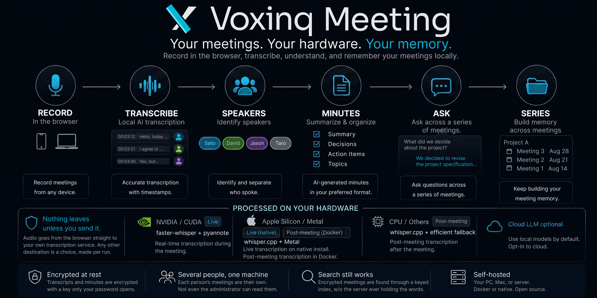
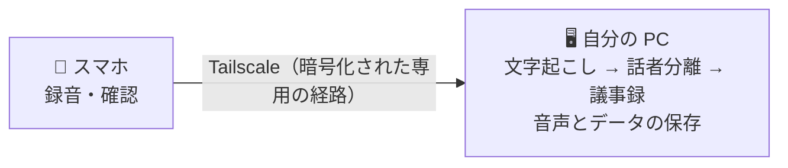

# Voxinq Meeting — 日本語ガイド

> **スマホで会議を録音し、自分の PC で文字起こし・話者分離・議事録作成まで行う、
> 自前で動かす会議記録アプリです。**
> 既定では音声も議事録も外部のサービスに送りません。

[English README](README.md)




```mermaid
flowchart LR
    phone["📱 スマホ<br/>録音・確認"]
    pc["🖥 自分の PC<br/>文字起こし → 話者分離 → 議事録<br/>音声とデータの保存"]
    phone -- "Tailscale（暗号化された専用の経路）" --> pc
```

**役割分担は「スマホ＝録音する端末、PC＝処理と保存をするサーバー」です。** PC は会議のあいだ
起動しておき、スマホからつなぎます。PC のブラウザだけで使うこともできます。

**推奨構成**：NVIDIA GPU 搭載の PC ＋ Android スマホ ＋ Tailscale

---

## 目次

1. [必要なもの](#1-必要なもの)
2. [セットアップ（最短手順）](#2-セットアップ最短手順)
3. [動作確認](#3-動作確認)
4. [基本的な使い方](#4-基本的な使い方)
5. [よく使う機能](#5-よく使う機能)
6. [困ったとき](#6-困ったとき)
7. [詳しいドキュメント](#7-詳しいドキュメント)

---

## 1. 必要なもの

| もの | 内容 |
| --- | --- |
| **PC** | Windows / Linux / macOS。会議のあいだ起動しておきます |
| **GPU** | **推奨**：NVIDIA 製、VRAM 8GB 以上。**必須ではありません**（下記） |
| **空き容量** | 約 40GB（GPU 無しなら約 20GB）。初回はイメージとモデルで十数 GB をダウンロードします |
| **Docker Desktop** | PC に入れます。無料です |
| **スマホ** | Android を推奨（専用アプリで画面を消しても録音が続きます）。iPhone はブラウザから使えます（下記） |
| **Tailscale** | PC とスマホの両方に入れます。個人利用は無料です |

**GPU が無い場合**：Mac でも GPU の無い PC でも動きます。違いは、文字が会議中ではなく
**会議の終了後にまとめて出る**ことと、議事録の作成に時間がかかること（1 本 15 分前後）です。
→ [GPU の種類による違い](docs/ja/setup.md#gpu-の種類による違い)

**iPhone の場合**：ブラウザで録音するため、**画面を消すと録音が止まることがあります**。
画面を点けたまま使ってください（録音中は自動で消えないようにしています）。画面を消したまま
長い会議を録るなら Android の専用アプリです。

### この構成でできること

1. スマホで会議を録音する
2. 話しながら文字起こしされる（GPU 無しなら会議の終了後）
3. 会議の後に「誰が話したか」を分ける
4. 自分の PC の AI で議事録を作る
5. スマホか PC で確認・修正し、議事録に質問する

---

## 2. セットアップ（最短手順）

NVIDIA GPU 搭載の Windows PC を例にしています。ほかの環境や、コマンドを使わずに入れる方法は
[詳しい導入手順](docs/ja/setup.md) にあります。

**① PC に Docker Desktop と Tailscale を、スマホに Tailscale を入れる**

- [Docker Desktop](https://www.docker.com/products/docker-desktop/)（NVIDIA GPU の PC では
  既定の WSL2 バックエンドのまま）
- [Tailscale](https://tailscale.com/download)。PC とスマホで**同じアカウント**にログインします

**② Tailscale で HTTPS を使えるようにし、PC のアドレスを調べる**

[管理コンソールの DNS](https://login.tailscale.com/admin/dns) で **MagicDNS** と
**HTTPS Certificates** を有効にします。PC のアドレスは `<ホスト名>.<テイルネット名>.ts.net`
という形で、[管理コンソールの機器一覧](https://login.tailscale.com/admin/machines)でコピーできます。

**③ Voxinq のファイルを 2 つ取得する**

```bash
mkdir voxinq
cd voxinq
curl -O https://raw.githubusercontent.com/ikasast/voxinq-meeting/release/docker-compose.yml
curl -o .env https://raw.githubusercontent.com/ikasast/voxinq-meeting/release/.env.example
```

**④ `.env` に 4 項目を書く**

```env
POSTGRES_PASSWORD="自分で決めるパスワード"
DATABASE_URL="postgresql://voxinq:上と同じパスワード@db:5432/voxinq"
TZ="Asia/Tokyo"
STT_WS_URL="wss://<ホスト名>.<テイルネット名>.ts.net:8443/ws"
```

- `STT_WS_URL` は、スマホから文字起こしサービスに届くアドレスです。**スマホで録音するなら必須**です
- ほかの項目は、使いたくなったときに足せば十分です → [`.env` の全項目](docs/ja/setup.md#env-に何を書くか)

**⑤ 起動する**

```bash
docker compose up -d
```

GPU の無い PC では、`docker-compose.cpu.yml` も取得して次のように起動します。

```bash
curl -O https://raw.githubusercontent.com/ikasast/voxinq-meeting/release/docker-compose.cpu.yml
docker compose -f docker-compose.yml -f docker-compose.cpu.yml up -d
```

**⑥ 議事録用の AI モデルを入れる**

```bash
docker compose exec ollama ollama pull qwen3:8b
```

アプリの **設定 → LLM** から管理者がダウンロードすることもできます。

**⑦ スマホに公開する**

```bash
tailscale serve --bg --https=443 localhost:3000
tailscale serve --bg --https=8443 localhost:8000
```

> ⚠️ 8443（文字起こしサービス）には認証がありません。**Tailscale の外（Funnel など）には
> 絶対に公開しないでください。**

**⑧ スマホで開く**

- **Android**：[Releases](https://github.com/ikasast/voxinq-meeting/releases/latest) から
  `voxinq-<版>.apk` を入れ、初回に `https://<ホスト名>.<テイルネット名>.ts.net` を入力します
- **iPhone**：Safari で `https://<ホスト名>.<テイルネット名>.ts.net/` を開き、画面右上の
  ⤓ アイコンから**ホーム画面に追加**します

これでセットアップは完了です。PC を再起動しても、Docker Desktop が起動すれば Voxinq も自動で立ち上がります
（Docker Desktop の「ログイン時に起動」が既定で有効です）。

---

## 3. 動作確認

「インストールできた」と「会議で使える」は別なので、一度だけ通しで試してください。
スマホから、短い会議を 1 本録ります。

- [ ] スマホで Voxinq が開ける
- [ ] **新しい会議** → **会議を準備する** → **マイクを確認する** で、レベルが動く
- [ ] **録音を開始** して話すと、文字が出る（GPU 無しなら、終了後に出れば OK）
- [ ] **議事録を作成** で終了すると、会議のページに議事録が出る
- [ ] 会議のページで **話者を分離** すると、発言が話者ごとに分かれる

話者の分離に失敗する場合、NVIDIA GPU の PC では `HF_TOKEN` の設定が必要です
→ [HF_TOKEN の取り方](docs/ja/setup.md#hf_token-の取り方nvidia-gpu-での話者分離に必要)。GPU の無い PC では設定不要です。

うまくいかないときは [困ったとき](#6-困ったとき) へ。

---

## 4. 基本的な使い方


### 会議の前

- PC が起動していることを確認し、スマホで Voxinq を開きます
- **新しい会議** で会議を作ります。「目的と議題」を書いておくと議事録の精度が上がります
- 先の会議は、日時を入れておけば「予定」に並び、Android アプリはその時刻に通知します

### 会議中

- **会議を準備する** → **マイクを確認する** → **録音を開始**
- **いちばん高くつく失敗は「録れていなかった」**です。録音前のマイク確認は 10 秒で済みます
- ブラウザで録音しているときは、**録音画面から他のページへ移らないでください**（録音が止まります）

### 会議の後

終了ボタンは 3 つあります。どれを押しても会議のページに移り、処理は PC 側で続くので、
**スマホは閉じて構いません**。

| ボタン | 動作 |
| --- | --- |
| **議事録を作成** | 終了して議事録を作る（通常はこれ） |
| **話者を分離** | 終了して、先に「誰の発言か」を分ける |
| **終了のみ** | 終了だけ。処理は後で |

### 確認と修正

- 議事録と文字起こしは、スマホでも PC でも見られます
- 聞き間違いは発言ごとに直せます。同じ誤変換は **検索と置換** でまとめて直せます
- 議事録は作り直せます。形式を変えることもできます
- 「前回までの TODO は？」のように、議事録に**質問**できます

---

## 5. よく使う機能

| 機能 | 概要 |
| --- | --- |
| 話者の自動命名 | 一度声を登録すると、以降の会議で名前が自動で付きます |
| シリーズ | 定例会議をまとめ、前回までの議事録を踏まえて書かせます |
| 予定 | 先の会議を入れておき、時刻に通知・ワンタップで録音 |
| まとめて議事録 | 録っておいた会議の議事録を一度に作ります |
| 既存の録音から | 音声ファイルをドロップ（Android は共有）すると議事録まで作ります |
| 日本語訳 | 外国語の発言に日本語訳を並べます |
| 複数人で使う | アカウントごとに会議を分け、本人の鍵で暗号化します |
| バックアップ | 全データを 1 ファイルに書き出し、別の PC に戻せます |

→ [機能の説明](docs/ja/guide.md)

---

## 6. 困ったとき

| 症状 | まず確認すること |
| --- | --- |
| スマホで開けない・真っ白 | スマホの Tailscale がつながっているか。`https://` で開いているか |
| 録音しても文字が出ない | `STT_WS_URL` が正しいか。GPU 無しなら終了後に出るのが正常です |
| 議事録ができない | `ollama pull` が済んでいるか（設定 → LLM で確認できます） |
| 話者分離が失敗する | NVIDIA GPU の PC なら `HF_TOKEN` |
| 予約の通知が来ない | Android アプリの通知の許可と、電池設定が「制限」になっていないか |

→ [困ったときの詳しい対処](docs/ja/troubleshooting.md)

---

## 7. 詳しいドキュメント

| ドキュメント | 内容 |
| --- | --- |
| [詳しい導入手順](docs/ja/setup.md) | 環境別の入れ方（Docker / `voxinq` コマンド / ネイティブ）、コマンドを使わない導入、`.env` の全項目、GPU の種類による違い、`HF_TOKEN`、更新のしかた |
| [機能の説明](docs/ja/guide.md) | 録音から議事録までの詳しい流れ、キュー、各機能、設定画面、Android アプリ |
| [セキュリティと外部公開](docs/ja/security.md) | 何が外に出るか、アカウントと暗号化、復旧コード、Tailscale の外からの閲覧、WireGuard |
| [困ったとき・FAQ](docs/ja/troubleshooting.md) | 症状別の対処とよくある質問 |
| [仕組み](docs/architecture.md)（英語） | 構成と設計の判断 |

## ライセンス

[MIT ライセンス](LICENSE) — © 2026 ikasast。使っている AI モデルには、それぞれ別のライセンスが
あります（pyannote のモデルは Hugging Face での規約同意が必要です）。個別の表示は
[NOTICE.md](NOTICE.md) に、イメージに含まれる全パッケージとそのライセンスは各リリースの添付ファイルにあります。
