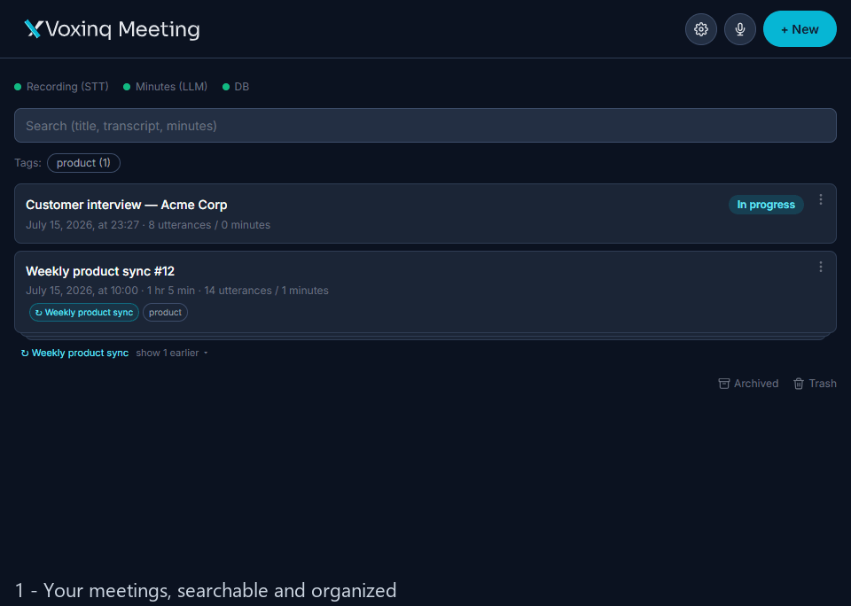
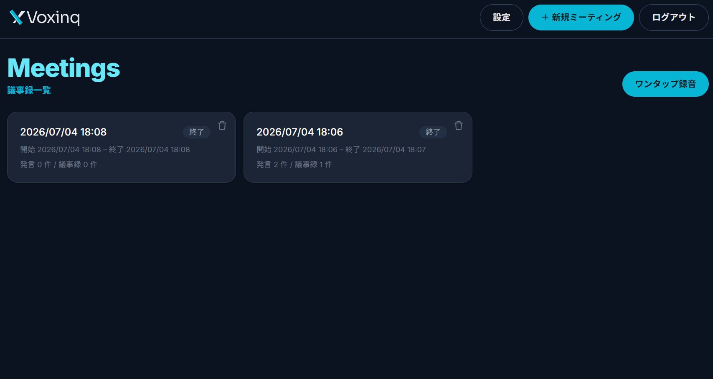
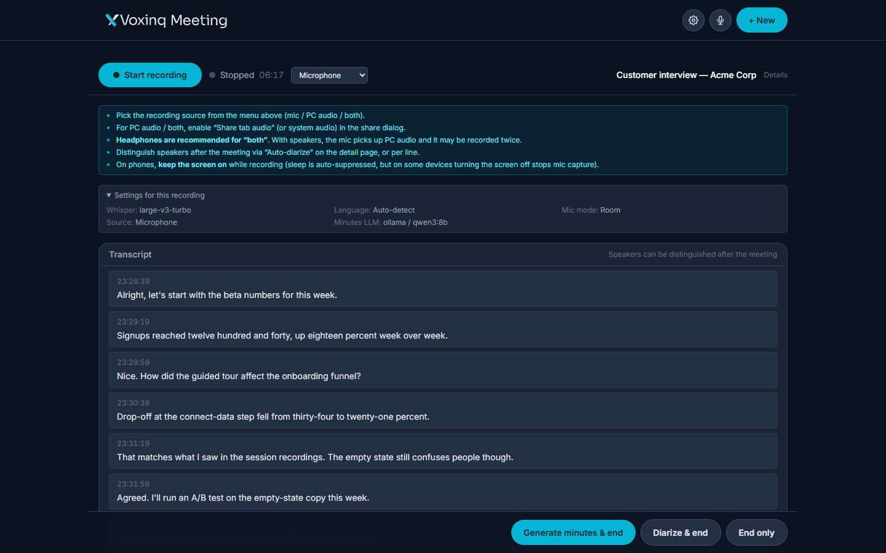
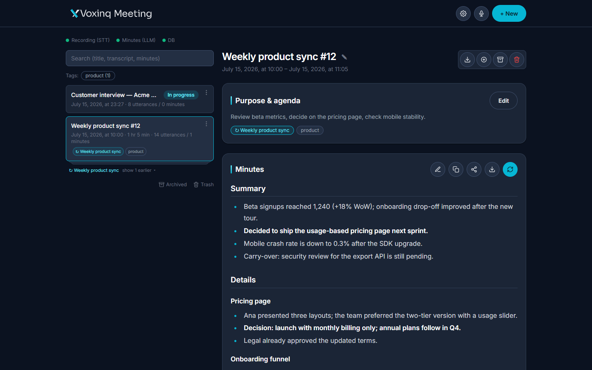
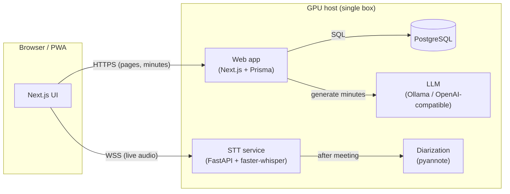

<div align="center">

# Voxinq

**Self-hosted meeting minutes — record in the browser, transcribe and summarize on your own GPU. Nothing leaves your machine.**

🎙️ **Record** in the browser → ⚡ **Transcribe** on your GPU → 📝 **Minutes** from your local LLM

<!-- When docs/screenshots/demo.gif is ready, replace the image below with:

-->



-76b900)


</div>

---

## ✨ Features

- 🎙️ **Real-time transcription** — stream mic (or PC audio) to a local [faster-whisper](https://github.com/SYSTRAN/faster-whisper) server over WebSocket, or just **drop an existing recording** (`wav`/`mp3`/`m4a`) to transcribe it.
- 📝 **LLM minutes, any LLM** — topic-grouped summary with decisions and action items, generated by the model you choose: Ollama (default, local), vLLM, LM Studio, or any OpenAI-compatible endpoint; Anthropic/OpenAI too.
- 🗣️ **Speaker diarization** — assign speakers to utterances after the meeting ([pyannote](https://github.com/pyannote/pyannote-audio)).
- 🔍 **Search, tags, period filters, archive & trash** — find meetings fast; soft-delete with 30-day restore.
- 🌐 **Access from your phone** — install as a PWA; reach it over [Tailscale](https://tailscale.com) with optional password auth.

## 💡 Why Voxinq?

Cloud transcription SaaS means uploading confidential meetings — research, legal, HR, strategy — to someone else's servers. Voxinq keeps everything on hardware you control.

| | **Voxinq** | Cloud SaaS |
| --- | --- | --- |
| **Privacy** | 100% local — audio never leaves your machine | Audio uploaded to a third party |
| **Cost** | Free — runs on a consumer GPU (8 GB VRAM) | Per-user / per-minute subscription |
| **Record anywhere** | Any browser incl. phone (PWA + Tailscale) | Any browser — via their cloud |
| **Models** | Pick any Whisper / LLM; swap or upgrade anytime | Fixed, vendor-chosen |

## 🚀 Get started

**Prerequisites:** an NVIDIA GPU (CUDA, 8 GB ok), Node.js 20+, Python 3.11, PostgreSQL 17, and [Ollama](https://ollama.com).

```bash
git clone https://github.com/ikasast/voxinq.git
cd voxinq
./scripts/setup.sh    # Windows: .\scripts\setup.ps1  — checks prereqs, installs everything
./scripts/start.sh    # Windows: .\scripts\start.ps1  — starts the STT service + web app
```

Then open `http://localhost:3000` → **New meeting → Start recording**, talk, and
**Generate minutes & end**. Minutes appear on the meeting page.
(Or just **drop an audio file** on the New meeting screen.)

📖 Manual install, background services, and phone access via Tailscale: **[docs/setup.md](docs/setup.md)**.

> ⚡ Always serve a production build (`scripts/start` does). `npm run dev` breaks hydration when accessed cross-origin (e.g. over Tailscale).

## 📖 Usage

- **Record a meeting:** New meeting → Start recording → speak → *Generate minutes & end*. Minutes generate in the background.
- **Summarize an existing file:** drag a recording onto the New meeting screen → it transcribes, then summarizes.
- **Improve speaker labels:** open a meeting → *Edit tools → Auto-diarize* → rename speakers; regenerate minutes.
- **Fix a bad transcript:** *Edit tools → Re-transcribe* with a larger model (e.g. `large-v3`), then regenerate.
- **Tune the output:** Settings → Minutes → set language, detail level (brief / standard / detailed), and a custom format.
- **Use a bigger model on an external GPU:** run vLLM/Ollama on a rented GPU, then set Settings → LLM to that endpoint.

| Recording | Minutes |
| --- | --- |
|  |  |

📚 **Full docs:** [Setup](docs/setup.md) · [Configuration](docs/configuration.md) · [LLM providers](docs/llm-providers.md) · [Usage & recipes](docs/usage.md) · [Architecture](docs/architecture.md) · [Troubleshooting](docs/troubleshooting.md)

## 🏗 Architecture



- The single GPU is **time-shared**: Whisper runs during the meeting; the LLM runs after it ends.
- The browser talks to STT **directly** (lowest latency); the web app never proxies audio.

## ⚙ Configuration

- **`.env`** (copy from [`.env.example`](.env.example)) — `DATABASE_URL`, the STT WebSocket URL, optional password auth.
- **`settings.json`** (edit in the UI under **Settings**, no restart) — Whisper model, LLM provider/model (Ollama / vLLM / LM Studio / Anthropic / OpenAI), minutes language, detail level, custom format, API keys.
- **Retention** — recordings auto-delete after 7 days (protect to keep); trashed meetings purge after 30 days.

Full reference: **[docs/configuration.md](docs/configuration.md)**.

## 🤝 Notes

- Whisper and the LLM cannot both stay resident on 8 GB — the app releases Whisper on meeting end.
- Similar open-source projects: [Meetily](https://github.com/Zackriya-Solutions/meeting-minutes), [Transcription Stream](https://github.com/transcriptionstream/transcriptionstream).

## 📄 License

Released under the [MIT License](LICENSE) — © 2026 Takafumi Sasaki.

You are free to use, modify, and distribute this software, including commercially, provided the copyright and license notice are retained. The software is provided "as is", without warranty of any kind.

> **Third-party components** ship under their own licenses. In particular, [pyannote.audio](https://github.com/pyannote/pyannote-audio) models require accepting the terms on Hugging Face, and Whisper / your chosen LLM (Ollama models, etc.) are subject to their respective licenses. Review these before deploying.
