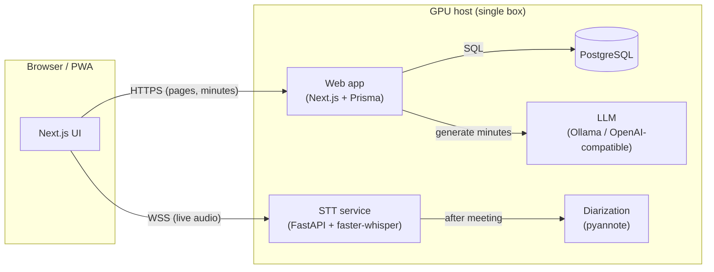

<div align="center">

# Voxinq

**Self-hosted meeting minutes — record in the browser, transcribe and summarize on your own GPU. Nothing leaves your machine.**

<!-- Header image goes here (e.g. docs/screenshots/dashboard.png) -->


-76b900)


</div>

---

## ✨ Features

- 🎙️ **Real-time transcription** — stream mic (or PC audio) to a local [faster-whisper](https://github.com/SYSTRAN/faster-whisper) server over WebSocket.
- 📝 **LLM minutes** — topic-grouped summary with decisions and action items, generated by a local LLM (Ollama by default).
- 🗣️ **Speaker diarization** — assign speakers to utterances after the meeting ([pyannote](https://github.com/pyannote/pyannote-audio)).
- 📂 **Drag & drop existing recordings** — drop a `wav`/`mp3`/`m4a`; it transcribes and summarizes without live capture.
- 🔁 **Regenerate & version history** — re-run minutes after edits; keep and compare past versions.
- ▶️ **Playback with click-to-seek** — click a line to jump to that moment in the recording.
- 🔍 **Search, tags, period filters, trash** — find meetings fast; soft-delete with 30-day restore.
- 🌐 **Access from your phone** — install as a PWA; reach it over [Tailscale](https://tailscale.com) with optional password auth.
- 🔧 **Swappable LLM** — Ollama, vLLM, LM Studio, or any OpenAI-compatible endpoint; Anthropic/OpenAI too.

## 💡 Why this project?

- **The problem:** most transcription tools upload your audio to a third party. That is a non-starter for confidential meetings (research, legal, HR, internal strategy).
- **What's wrong with alternatives:** cloud SaaS = privacy/compliance risk; classic on-prem tools are clunky and single-machine.
- **The strengths:**
  - 100% local — audio, transcripts, and minutes stay on your hardware.
  - GPU-efficient — fits in **8 GB VRAM** by time-sharing Whisper (during) and the LLM (after).
  - Web-native — record from any browser, including a phone.
  - Model-agnostic — start with a small local model, swap in a bigger one (or an external GPU) later.
- **Who it's for:** researchers and teams who need meeting minutes but cannot send audio to the cloud.

## 📦 Installation

**Prerequisites:** an NVIDIA GPU (CUDA), Node.js 20+, Python 3.11, PostgreSQL 17, and [Ollama](https://ollama.com) (or another LLM endpoint).

```bash
git clone https://github.com/ikasast/voxinq.git
cd voxinq
npm install

# LLM (default): pull a model that fits 8GB VRAM
ollama pull qwen2.5:7b-instruct

# STT service (separate venv)
cd stt-service && python -m venv .venv && . .venv/Scripts/activate   # Linux: source .venv/bin/activate
pip install -r requirements.txt && cd ..

# Diarization (separate venv, GPU torch — optional but recommended)
cd diarization && python -m venv .venv && . .venv/Scripts/activate
pip install torch torchaudio --index-url https://download.pytorch.org/whl/cu128
pip install -r requirements.txt && cd ..
```

Create `.env` (see [Configuration](#-configuration)), then create the database schema:

```bash
npx prisma db push
```

- **Windows (primary host):** register background tasks with the helper scripts —
  `scripts/windows/install-db-task.ps1`, `install-web-task.ps1`, and `stt-service/install-startup-task.ps1`.
- **Linux:** use `scripts/redeploy.sh` for the web app and the provided `stt-service/voxinq-stt.service` systemd unit.

## 🚀 Quick Start

```bash
# 1. Start the STT service (GPU)
cd stt-service && . .venv/Scripts/activate && python -m uvicorn server:app --host 0.0.0.0 --port 8000

# 2. Build & start the web app (production build — required for cross-device access)
npm run build && npm start
```

Then:

1. Open `http://localhost:3000`.
2. Click **New meeting → Start recording**, talk, then **Generate minutes & end**.
3. Minutes appear on the meeting page. (Or just **drop an audio file** on the New meeting screen.)

> ⚡ Always serve a production build (`npm run build && npm start`). `npm run dev` breaks hydration when accessed cross-origin (e.g. over Tailscale).

## 📖 Usage

- **Record a meeting:** New meeting → Start recording → speak → *Generate minutes & end*. Minutes generate in the background.
- **Summarize an existing file:** drag a recording onto the New meeting screen → it transcribes, then summarizes.
- **Improve speaker labels:** open a meeting → *Edit tools → Auto-diarize* → rename speakers; regenerate minutes.
- **Fix a bad transcript:** *Edit tools → Re-transcribe* with a larger model (e.g. `large-v3`), then regenerate.
- **Tune the output:** Settings → Minutes → set language, detail level (brief / standard / detailed), and a custom format.
- **Use a bigger model on an external GPU:** run vLLM/Ollama on a rented GPU, then set Settings → LLM to that endpoint.

## 🏗 Architecture



- The single GPU is **time-shared**: Whisper runs during the meeting; the LLM runs after it ends.
- The browser talks to STT **directly** (lowest latency); the web app never proxies audio.

## ⚙ Configuration

**`.env`** (build/runtime, gitignored):

| Variable | Purpose |
| --- | --- |
| `DATABASE_URL` | PostgreSQL connection string |
| `NEXT_PUBLIC_STT_WS_URL` | STT WebSocket URL (baked in at build time) |
| `APP_PASSWORD` | Optional password auth (unset = open within your network) |
| `APP_SESSION_SECRET` | Secret for the auth cookie |
| `NETWORK_MODE` | `tailscale` (default) or `lan` |

**`settings.json`** (runtime, editable in the UI, gitignored) — Whisper model, LLM provider/model, minutes language, detail level, custom format, business background, and API keys.

- **LLM providers:** `ollama` (default), or `openai` for any OpenAI-compatible server. LM Studio (`http://localhost:1234/v1`) and vLLM (`http://localhost:8000/v1`) need no API key.
- **Retention:** recordings auto-delete after 7 days (protect to keep); trashed meetings purge after 30 days.

## 🤝 Notes

- Whisper and the LLM cannot both stay resident on 8 GB — the app releases Whisper on meeting end.
- Similar open-source projects: [Meetily](https://github.com/Zackriya-Solutions/meeting-minutes), [Transcription Stream](https://github.com/transcriptionstream/transcriptionstream).
- **License:** none yet. This project was bootstrapped from an unlicensed base repo; obtain the original author's permission before publishing or redistributing.
