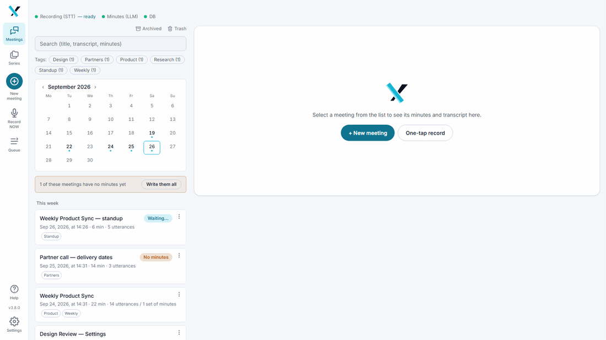
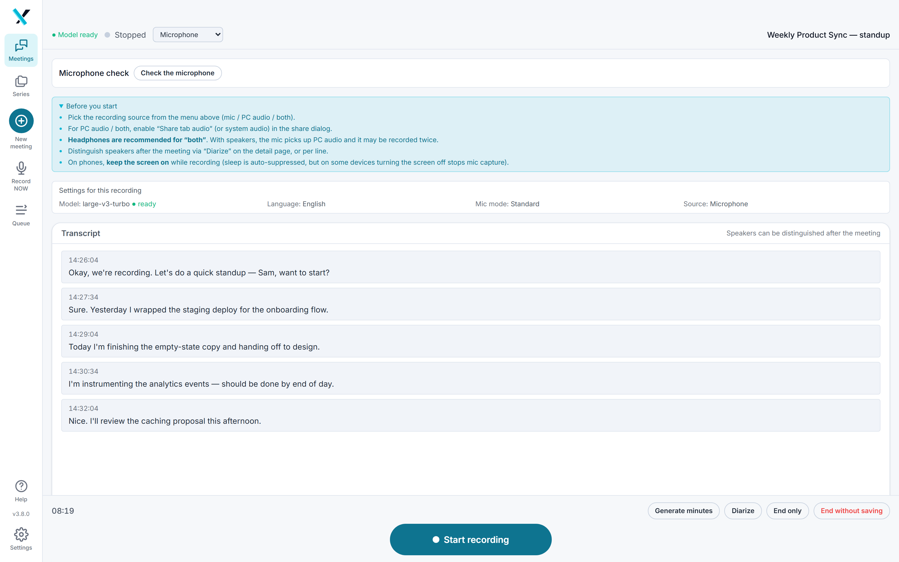
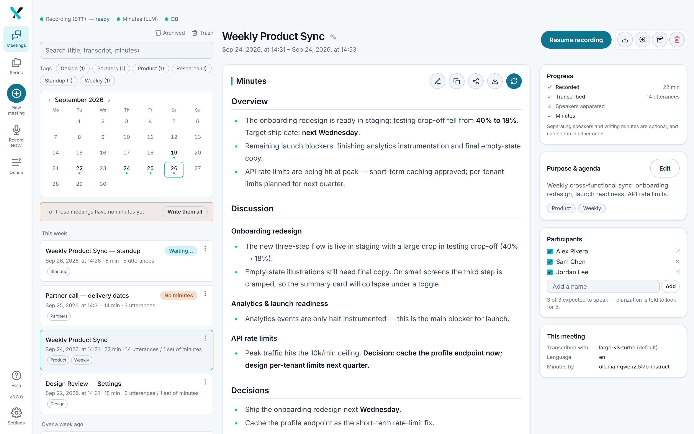
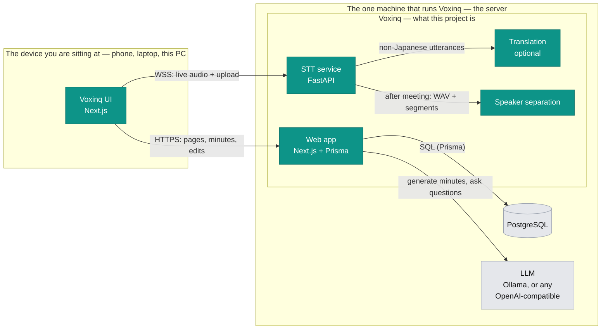

<div align="center">

# Voxinq Meeting

**Self-hosted meeting minutes — record in the browser, transcribe and summarize on your own machine. By default nothing leaves it, and every route off it is one you choose.**

[**日本語の解説はこちら →**](README.ja.md)


</div>

---

## ✨ Features

- 🎙️ **Live transcription where the hardware allows** — stream mic (or PC audio) to a local Whisper server over WebSocket: [faster-whisper](https://github.com/SYSTRAN/faster-whisper) on CUDA, [whisper.cpp](https://github.com/ggerganov/whisper.cpp) elsewhere, chosen for you. Words appear as you speak on an NVIDIA GPU or Apple silicon; other machines transcribe in one pass when the meeting ends. That pass can also be sent to a saved endpoint — anything OpenAI-compatible (Groq, OpenAI, **a whisper server of your own**) or Google Gemini — which turns a three-hour wait on a CPU-only box into minutes. Several can be saved and **the one to use is picked per run**, this machine included. Or just **drop an existing recording** (`wav`/`mp3`/`m4a`).
- 📝 **LLM minutes, any LLM** — topic-grouped summary with decisions and action items, generated by the model you choose: Ollama (default, local), vLLM, LM Studio, or any OpenAI-compatible endpoint; Anthropic/OpenAI too. Formats are saved with names and picked when the minutes are written — a talk is not a meeting, and the same headings leave a lecture with empty sections.
- 💬 **Ask your minutes** — “what were the TODOs from last time?” answered from a series' minutes, grounded in them and told to say when something is not recorded.
- 🌏 **Live Japanese translation** (optional) — a Japanese translation under each non-Japanese utterance, produced on the CPU so it never competes with transcription for the GPU.
- 🗣️ **Speaker separation with voice profiles** — assign speakers after the meeting ([pyannote](https://github.com/pyannote/pyannote-audio) on CUDA, [sherpa-onnx](https://github.com/k2-fsa/sherpa-onnx) everywhere else — no Hugging Face token needed on that path), and enrol a voice once so it is **named automatically** in every future meeting.
- 👥 **Participants, which the diarizer uses** — list who was there and tick who is expected to speak; the count becomes the number of voices separation looks for, and the names narrow which enrolled voice profiles can be matched. Someone who attended in silence stays on the list and off the count.
- 🗓️ **Book a meeting before it happens** — put the title, agenda, series and participants in ahead of time; it waits under **Upcoming** until you press record.
- 🔁 **Recurring series** — link meetings into a series; the previous minutes are fed to the LLM as context, and each series can carry its own minutes format and glossary.
- 🔍 **Search, tags, archive & trash** — find meetings fast; soft-delete with 30-day restore. Search keeps working after encryption, through an index of keyed hashes rather than by reading.
- 👤 **Accounts, if you want them** — one person needs nothing; the moment somebody creates an account the server becomes multi-user, and each person's meetings, voiceprints and settings are their own. **An administrator runs the machine and cannot read what is on it** — the shared queue shows whose work is waiting and never what it is about.
- 🔐 **Encrypted at rest** — transcripts and minutes are encrypted under a key belonging to the account, unwrapped by your password and by a **recovery code shown once**. A stolen disk, a database dump or a backup on its own reads nothing.
- 🌐 **Phone access & read-only sharing** — install as a PWA and reach it over [Tailscale](https://tailscale.com) with optional password auth. One click in **Settings → Remote access** publishes a password-protected, **read-only** public link (view & download only) for people outside your tailnet — recording, editing and the transcription service stay private.

## 💡 Why Voxinq Meeting?

Cloud transcription SaaS means uploading confidential meetings — research, legal, HR, strategy — to someone else's servers. Voxinq Meeting keeps everything on hardware you control.

**Everything runs on your machine, and every route off it is one you choose.** By default nothing leaves: the browser streams audio straight to the transcription service you are running, minutes are written by a local Ollama, and the app fetches no external URL at runtime. Recognition *can* be sent to a saved endpoint (Groq, OpenAI, Google Gemini, or a whisper server of your own), and the LLM *can* be pointed at Anthropic or OpenAI — both are off until you turn them on, chosen per run rather than once and forgotten, and the destination host is named on screen wherever it is in force. Voiceprints and the database never leave regardless. Nothing is phoned home either way.

| | **Voxinq Meeting** | Cloud SaaS |
| --- | --- | --- |
| **Privacy** | Runs entirely on your own hardware; every route off it is opt-in and named on screen | Audio uploaded to a third party |
| **Who can read it** | Encrypted per account — not even the administrator of the machine | Whoever holds the vendor's keys |
| **Cost** | Free — a consumer GPU (8 GB VRAM) is plenty, and it runs without one | Per-user / per-minute subscription |
| **Record anywhere** | Any browser incl. phone (PWA + Tailscale) | Any browser — via their cloud |
| **Models** | Choose the Whisper model and the LLM; swap or upgrade anytime | Fixed, vendor-chosen |

## 🚀 Get started

**An NVIDIA GPU is the best experience, not a requirement.** What changes without one is
*when* you see the text, not whether you get it:

| your machine | transcription | when the text appears |
| --- | --- | --- |
| **NVIDIA GPU** (8 GB is plenty) | faster-whisper on CUDA | as you speak |
| **Apple silicon** | whisper.cpp on Metal | as you speak |
| **AMD/Intel GPU, or CPU only** | whisper.cpp on the CPU — the GPU is not used | when the meeting ends |

A machine with no GPU acceleration recognises speech slower than people produce it, so instead
of falling behind for the whole meeting it records and transcribes the file in one pass at the
end. Same model — though not the same weights: the CPU path runs GGML-quantised ones, and on a
measured meeting its transcript diverges from the CUDA transcript by about **14% of
characters**. Neither is ground truth, so read that as a difference rather than a defect — but
it is not nothing. See [what runs on what](docs/setup.md#what-runs-on-what).

**Writing the minutes is slower without a GPU too**, and by more. Measured on a 16-core x86 CPU
with an 8B model: 31 tokens/second reading the transcript, 6.5 writing — about **a quarter of an
hour** for a meeting that fills the context budget, against under a minute on an 8 GB card. It
runs unattended in the background, and a smaller model or an LLM endpoint on another machine
brings it back down — `Settings → LLM`, see
[the minutes on a CPU](docs/setup.md#and-the-minutes).

**With Docker** — brings up the database, web app, transcription service and Ollama together.
On an NVIDIA machine it also needs the [NVIDIA Container Toolkit](https://docs.nvidia.com/datacenter/cloud-native/container-toolkit/latest/install-guide.html) (on Windows, Docker Desktop with WSL2).
The images are published, so there is no clone and no Node or Python on the host — two files
are the whole install:

```bash
mkdir voxinq && cd voxinq
curl -O https://raw.githubusercontent.com/ikasast/voxinq-meeting/release/docker-compose.yml
curl -o .env https://raw.githubusercontent.com/ikasast/voxinq-meeting/release/.env.example
# edit .env: set POSTGRES_PASSWORD and TZ, and point DATABASE_URL at the `db` service
docker compose up -d
docker compose exec ollama ollama pull qwen2.5:7b-instruct   # the minutes model (see below)
```

The first pull is about 7.5 GB and unpacks to about 21 GB on disk — nearly all of it CUDA and
PyTorch. **Without an NVIDIA GPU, use the CPU images instead** — they are multi-arch, so they
also run on Apple silicon, and take under 0.5 GB to pull and 1.8 GB on disk:

```bash
docker compose -f docker-compose.yml -f docker-compose.cpu.yml up -d
```

Speaker separation on an NVIDIA GPU uses pyannote: accept the terms for
[speaker-diarization-community-1](https://huggingface.co/pyannote/speaker-diarization-community-1)
and put your token in `.env` as `HF_TOKEN`. Everywhere else it runs on ungated ONNX models and
needs no token — see [Speaker separation](docs/setup.md#speaker-separation).

**Without Docker** — one command brings up a bundled PostgreSQL, the transcription service and
the web app. Node and Python come from the package manager; nothing else to install.

```bash
brew install ikasast/voxinq/voxinq                             # macOS, Linux
scoop bucket add voxinq https://github.com/ikasast/scoop-voxinq   # Windows
scoop install voxinq

voxinq setup      # dependencies, build, speech models — a few minutes
voxinq start      # and it opens in your browser
```

The Scoop route is verified end to end; the Homebrew formula is written but has not been
installed from, for want of a Mac. From a clone, `cd cli && npm install && npm link` gives you
the same `voxinq` command.

Then open `http://localhost:3000` → **New meeting → Set up meeting**, press **Start recording**
on the next screen once it says *Model ready*, talk, and finish with **Generate minutes**.
(Or just **drop an audio file** on the New meeting screen.)

📖 Docker details, manual install and background services: **[docs/setup.md](docs/setup.md)**.
To record from your phone, you need an HTTPS address it can reach — the Tailscale walkthrough
is **[here](docs/remote-access.md#step-by-step-including-the-phone)**.

> ⚡ Always serve a production build (`scripts/start` does). `npm run dev` breaks hydration when accessed cross-origin (e.g. over Tailscale).

## 📖 Usage

- **Record a meeting:** New meeting → *Set up meeting* → *Start recording* (the wide button at the bottom, where a thumb reaches it) → speak → *Generate minutes*. Minutes generate in the background while you land on the meeting.
- **Summarize an existing file:** drag a recording onto the New meeting screen → it transcribes, then summarizes.
- **Ask about past meetings:** open a series (↻ chip) → *Ask about these minutes* → “前回までのTODOを教えて”.
- **Improve speaker labels:** open a meeting → *Diarize* above the transcript → rename speakers; regenerate minutes.
- **Fix or drop a line:** hover an utterance → ✎ to correct a misheard name, 🗑 to remove it. Minutes are then built from the right words.
- **Fix the same mishearing everywhere:** *Find & replace*, below the speaker names — preview the matches, then replace across the transcript in one go.
- **Fix a bad transcript:** *Re-transcribe* with a larger model (e.g. `large-v3`) or a saved endpoint, then regenerate.
- **Send the minutes on:** the ⬇ on the Minutes card saves them as Markdown, **Word (`.docx`)** with real formatting, or **PDF** through your browser's print view. The meeting's own ⬇ bundles transcript, metadata and recording alongside.
- **Tune the output:** Settings → Minutes → set language, detail level (brief / standard / detailed), and save formats to pick from when writing.
- **Share the machine:** create the first account (**Create an account**, linked from the login screen) — you become the administrator, and everything already on the server becomes yours. Everyone else signs in, or is recognised by their tailnet identity. **Keep the recovery code you are shown**; it is the only way back into your own meetings if you forget the password.
- **Use a bigger model on an external GPU:** run vLLM/Ollama on a rented GPU, then set Settings → LLM to that endpoint.



| Recording | Minutes |
| --- | --- |
|  |  |

## 📚 Documentation

| I want to… | Read |
| --- | --- |
| **Install it** (all three routes, background services, phone access) | 📦 [Setup](docs/setup.md) |
| **Reach it from a phone / share read-only** (Tailscale, publish toggle, WireGuard) | 🌐 [Remote access](docs/remote-access.md) |
| **Change a setting** (every `.env` variable and `settings.json` option) | ⚙️ [Configuration](docs/configuration.md) |
| **Use a different LLM** (Ollama, vLLM, LM Studio, Anthropic, OpenAI, external GPU) | 🤖 [LLM providers](docs/llm-providers.md) |
| **Learn the features** (record, upload, diarize, find & replace, export, archive) | 📖 [Usage & recipes](docs/usage.md) |
| **Understand how it works** (components, data flow, what is Voxinq and what is not) | 🏗 [Architecture](docs/architecture.md) |
| **Understand *why*** (the trade-offs, and what was tried and rejected) | 🧭 [Design decisions](docs/design-decisions.md) |
| **Fix a problem** (common issues and their causes) | 🩺 [Troubleshooting](docs/troubleshooting.md) |

日本語で読む方は **[日本語ガイド](README.ja.md)** をどうぞ — 導入から日常運用まで一通り解説しています。

## 🏗 Architecture


```mermaid
flowchart LR
  subgraph Browser["The device you are sitting at — phone, laptop, this PC"]
    UI["Voxinq UI<br/>Next.js"]
  end
  subgraph Host["The one machine that runs Voxinq — the server"]
    subgraph Vox["Voxinq — what this project is"]
      Web["Web app<br/>Next.js + Prisma"]
      STT["STT service<br/>FastAPI"]
      TR["Translation<br/>optional"]
      DIA["Speaker separation"]
    end
    DB[("PostgreSQL")]
    LLM["LLM<br/>Ollama, or any<br/>OpenAI-compatible"]
  end

  UI -- "HTTPS: pages, minutes, edits" --> Web
  UI -- "WSS: live audio + upload" --> STT
  Web -- "SQL (Prisma)" --> DB
  Web -- "generate minutes, ask questions" --> LLM
  STT -- "non-Japanese utterances" --> TR
  STT -- "after meeting: WAV + segments" --> DIA

  classDef own fill:#0d9488,stroke:#0f766e,color:#fff
  classDef ext fill:#e5e7eb,stroke:#9ca3af,color:#111
  class UI,Web,STT,TR,DIA own
  class DB,LLM ext
```

**The two outer boxes are two different computers.** Everything on the right runs on one machine
you control — the server. On the left is whatever you open it on: a phone, a laptop, or that
same machine's own browser.

- Shaded is **Voxinq's own code**; grey is software it runs but does not replace. The
  recognition engine is third-party too — the STT service picks between faster-whisper and
  whisper.cpp, and speaker separation between pyannote and sherpa-onnx, from what the machine
  can run.
- The browser talks to the STT service **directly** — the web app never proxies audio. That is
  what makes recording from a phone work, and why the recording never travels further than the
  one machine.
- On a single 8 GB NVIDIA card the GPU is **time-shared**: Whisper runs during the meeting, the
  LLM after it ends. With more VRAM, or none at all, there is nothing to take turns over.
- The meeting list is banded by how long ago things happened, a **calendar** over it turns a
  half-remembered date into a place to click, and a recurring series lists its meetings
  individually rather than folding them behind a disclosure — its chip filters the list instead.
- **The microphone can be checked before recording**, and the microphone the check opens is the
  one the recording uses. A meeting nobody recorded is the one failure here that cannot be
  undone.
- **Several people can share one instance.** Each person's meetings, minutes, voiceprints and
  settings are their own; an administrator runs the machine and cannot read what is on it.
  Ownership is enforced inside the database client rather than on each route, so a route that
  forgets cannot leak.
- **Transcripts and minutes are encrypted at rest** under a key belonging to the account, opened
  by signing in and forgotten when nothing needs it. Titles and dates stay readable — they are
  what the list and the calendar are made of. Search still works, through an index of keyed
  hashes, so the server matches without holding the words. What that protects, and what it does
  not, is written down in [design decisions](docs/design-decisions.md).
- Minutes, speaker separation and re-transcription are a **server-side queue**, so closing the
  tab does not abandon them. How many run at once is worked out from what each expects to need
  and what the card has — work sent to a cloud model or an endpoint costs nothing here and
  never waits. **Recording never waits**: if something else holds the card it asks whether to
  interrupt it or to record without live text, and the audio is kept either way.

📖 Full detail, component by component: **[docs/architecture.md](docs/architecture.md)**.

## ⚙ Configuration

- **`.env`** (copy from [`.env.example`](.env.example)) — `DATABASE_URL`, the STT WebSocket URL, optional password auth, whether accounts can be created (`VOXINQ_SIGNUP`), and the secret that wraps unlocked keys (`VOXINQ_KEY_SECRET`).
- **`settings.json`** (edit in the UI under **Settings**, no restart) — Whisper model, LLM provider/model (Ollama / vLLM / LM Studio / Anthropic / OpenAI), minutes language, detail level, custom format, API keys. With accounts, some of these belong to the machine and some to each person; an administrator sets the defaults everyone starts from.
- **Retention** — recordings auto-delete after 7 days (protect to keep); trashed meetings purge after 30 days.

Full reference: **[docs/configuration.md](docs/configuration.md)**.

## 🤝 Notes

- Whisper and the LLM cannot both stay resident on 8 GB — the app releases Whisper on meeting end.
- Similar open-source projects: [Meetily](https://github.com/Zackriya-Solutions/meeting-minutes), [Transcription Stream](https://github.com/transcriptionstream/transcriptionstream).

## 📄 License

Released under the [MIT License](LICENSE) — © 2026 ikasast.

You are free to use, modify, and distribute this software, including commercially, provided the copyright and license notice are retained. The software is provided "as is", without warranty of any kind.

> **Third-party components** ship under their own licenses. [pyannote.audio](https://github.com/pyannote/pyannote-audio) models require accepting the terms on Hugging Face — that path is used only on an NVIDIA GPU; elsewhere speaker separation runs on ungated ONNX models. Whisper and your chosen LLM (Ollama models, etc.) are subject to their respective licenses. Review these before deploying.
