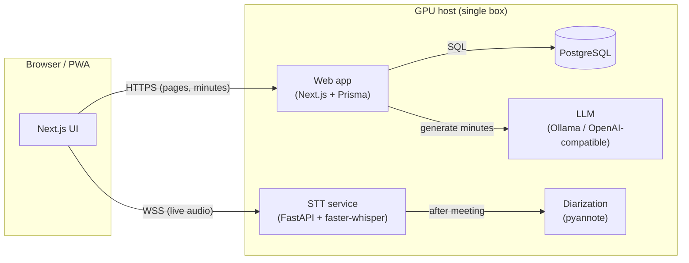

<div align="center">

# Voxinq Meeting

**Self-hosted meeting minutes — record in the browser, transcribe and summarize on your own GPU. Your audio never leaves your machine, and by default nothing else does either.**

[**日本語の解説はこちら →**](README.ja.md)


-76b900)


</div>

---

## ✨ Features

- 🎙️ **Real-time transcription** — stream mic (or PC audio) to a local [faster-whisper](https://github.com/SYSTRAN/faster-whisper) server over WebSocket, with words appearing as you speak, or just **drop an existing recording** (`wav`/`mp3`/`m4a`) to transcribe it.
- 📝 **LLM minutes, any LLM** — topic-grouped summary with decisions and action items, generated by the model you choose: Ollama (default, local), vLLM, LM Studio, or any OpenAI-compatible endpoint; Anthropic/OpenAI too.
- 💬 **Ask your minutes** — “what were the TODOs from last time?” answered from a series' minutes, grounded in them and told to say when something is not recorded.
- 🌏 **Live Japanese translation** (optional) — a Japanese translation under each non-Japanese utterance, produced on the CPU so it never competes with transcription for the GPU.
- 🗣️ **Speaker diarization with voice profiles** — assign speakers after the meeting ([pyannote](https://github.com/pyannote/pyannote-audio) `speaker-diarization-community-1`), and enrol a voice once so it is **named automatically** in every future meeting.
- 🔁 **Recurring series** — link meetings into a series; the previous minutes are fed to the LLM as context, and each series can carry its own minutes format and glossary.
- 🔍 **Search, tags, archive & trash** — find meetings fast; soft-delete with 30-day restore.
- 🌐 **Phone access & read-only sharing** — install as a PWA and reach it over [Tailscale](https://tailscale.com) with optional password auth. One click in **Settings → Remote access** publishes a password-protected, **read-only** public link (view & download only) for people outside your tailnet — recording, editing and the transcription service stay private.

## 💡 Why Voxinq Meeting?

Cloud transcription SaaS means uploading confidential meetings — research, legal, HR, strategy — to someone else's servers. Voxinq Meeting keeps everything on hardware you control.

**Audio is local by construction.** The browser streams it straight to the transcription service on your own machine — the web app never proxies it, and there is no code path that sends a recording anywhere else. Minutes are local by default too (Ollama). If you *choose* to point the LLM at Anthropic, OpenAI, or a rented GPU, the finished transcript goes to that endpoint — your decision, off by default. Nothing is phoned home either way.

| | **Voxinq Meeting** | Cloud SaaS |
| --- | --- | --- |
| **Privacy** | Audio never leaves your machine; minutes local by default, cloud LLM opt-in | Audio uploaded to a third party |
| **Cost** | Free — runs on a consumer GPU (8 GB VRAM) | Per-user / per-minute subscription |
| **Record anywhere** | Any browser incl. phone (PWA + Tailscale) | Any browser — via their cloud |
| **Models** | Pick any Whisper / LLM; swap or upgrade anytime | Fixed, vendor-chosen |

## 🚀 Get started

**Prerequisites:** an NVIDIA GPU (CUDA, 8 GB is enough) with its driver installed.

**With Docker** — brings up the database, web app, transcription service and Ollama together.
Also needs Docker Compose and the [NVIDIA Container Toolkit](https://docs.nvidia.com/datacenter/cloud-native/container-toolkit/latest/install-guide.html) (on Windows, Docker Desktop with WSL2).

```bash
git clone https://github.com/ikasast/voxinq-meeting.git
cd voxinq-meeting
cp .env.example .env    # set POSTGRES_PASSWORD, point DATABASE_URL at the `db` service
docker compose up -d
docker compose exec ollama ollama pull qwen2.5:7b-instruct
```

**Native** — no containers; needs Node.js 20+, Python 3.11, PostgreSQL 17 and [Ollama](https://ollama.com) on the host.

```bash
git clone https://github.com/ikasast/voxinq-meeting.git
cd voxinq-meeting
./scripts/setup.sh    # Windows: .\scripts\setup.ps1  — checks prereqs, installs everything
./scripts/start.sh    # Windows: .\scripts\start.ps1  — starts the STT service + web app
```

Then open `http://localhost:3000` → **New meeting → Set up meeting**, press **Start recording**
on the next screen once it says *Model ready*, talk, and finish with **Generate minutes**.
(Or just **drop an audio file** on the New meeting screen.)

📖 Docker details, manual install, background services, and phone access via Tailscale: **[docs/setup.md](docs/setup.md)**.

> ⚡ Always serve a production build (`scripts/start` does). `npm run dev` breaks hydration when accessed cross-origin (e.g. over Tailscale).

## 📖 Usage

- **Record a meeting:** New meeting → *Set up meeting* → *Start recording* → speak → *Generate minutes*. Minutes generate in the background while you land on the meeting.
- **Summarize an existing file:** drag a recording onto the New meeting screen → it transcribes, then summarizes.
- **Ask about past meetings:** open a series (↻ chip) → *Ask about these minutes* → “前回までのTODOを教えて”.
- **Improve speaker labels:** open a meeting → *Diarize* above the transcript → rename speakers; regenerate minutes.
- **Fix or drop a line:** hover an utterance → ✎ to correct a misheard name, ✕ to remove it. Minutes are then built from the right words.
- **Fix a bad transcript:** *Re-transcribe* with a larger model (e.g. `large-v3`), then regenerate.
- **Tune the output:** Settings → Minutes → set language, detail level (brief / standard / detailed), and a custom format.
- **Use a bigger model on an external GPU:** run vLLM/Ollama on a rented GPU, then set Settings → LLM to that endpoint.


| Recording | Minutes |
| --- | --- |
|  |  |

📚 **Full docs:** [Setup](docs/setup.md) · [Configuration](docs/configuration.md) · [LLM providers](docs/llm-providers.md) · [Usage & recipes](docs/usage.md) · [Architecture](docs/architecture.md) · [Design decisions](docs/design-decisions.md) · [Troubleshooting](docs/troubleshooting.md)

## 🏗 Architecture


```mermaid
flowchart LR
  subgraph Browser["Browser / PWA"]
    UI["Next.js UI"]
  end
  subgraph Host["GPU host (single box)"]
    Web["Web app<br/>(Next.js + Prisma)"]
    DB[("PostgreSQL")]
    STT["STT service<br/>(FastAPI + faster-whisper)"]
    DIA["Diarization<br/>(pyannote)"]
    LLM["LLM<br/>(Ollama / OpenAI-compatible)"]
  end

  UI -- "HTTPS (pages, minutes)" --> Web
  UI -- "WSS (live audio)" --> STT
  Web -- "SQL" --> DB
  Web -- "generate minutes" --> LLM
  STT -- "after meeting" --> DIA
```

- The single GPU is **time-shared**: Whisper runs during the meeting; the LLM runs after it ends.
- The browser talks to STT **directly** (lowest latency); the web app never proxies audio.

## ⚙ Configuration

- **`.env`** (copy from [`.env.example`](.env.example)) — `DATABASE_URL`, the STT WebSocket URL, optional password auth.
- **`settings.json`** (edit in the UI under **Settings**, no restart) — Whisper model, LLM provider/model (Ollama / vLLM / LM Studio / Anthropic / OpenAI), minutes language, detail level, custom format, API keys.
- **Retention** — recordings auto-delete after 7 days (protect to keep); trashed meetings purge after 30 days.

Full reference: **[docs/configuration.md](docs/configuration.md)**.

## 🤝 Notes

- Whisper and the LLM cannot both stay resident on 8 GB — the app releases Whisper on meeting end.
- Similar open-source projects: [Meetily](https://github.com/Zackriya-Solutions/meeting-minutes), [Transcription Stream](https://github.com/transcriptionstream/transcriptionstream).

## 📄 License

Released under the [MIT License](LICENSE) — © 2026 ikasast.

You are free to use, modify, and distribute this software, including commercially, provided the copyright and license notice are retained. The software is provided "as is", without warranty of any kind.

> **Third-party components** ship under their own licenses. In particular, [pyannote.audio](https://github.com/pyannote/pyannote-audio) models require accepting the terms on Hugging Face, and Whisper / your chosen LLM (Ollama models, etc.) are subject to their respective licenses. Review these before deploying.
