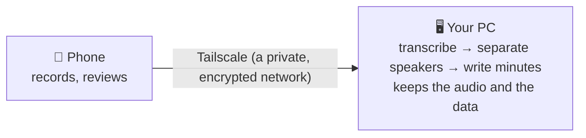
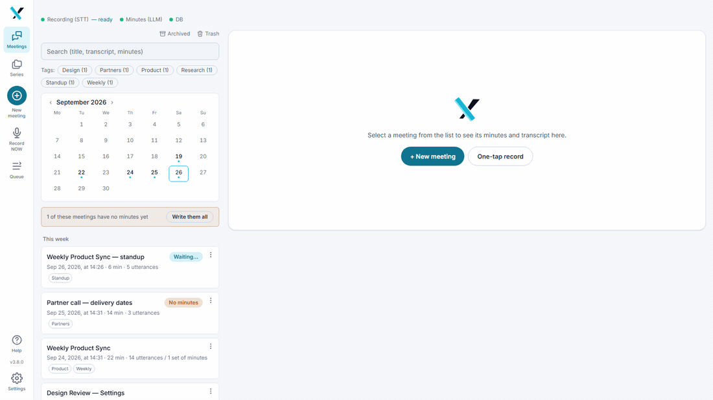
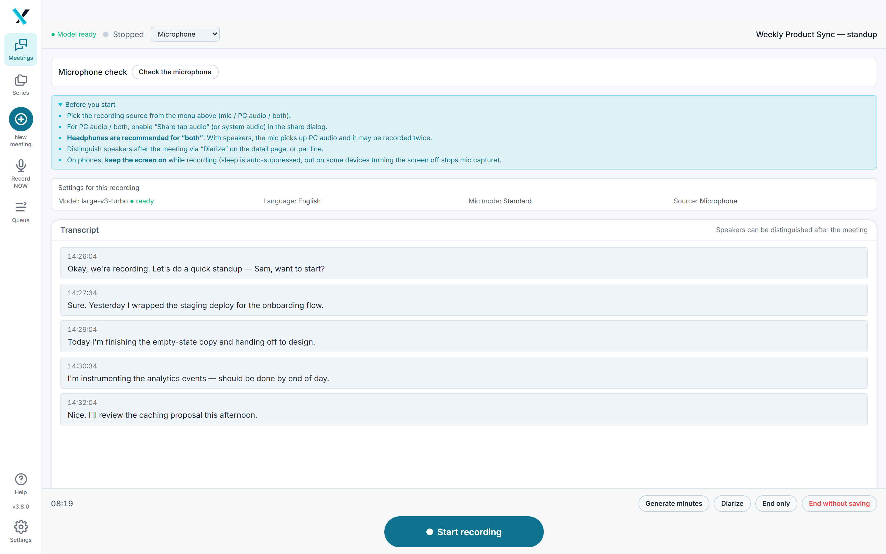
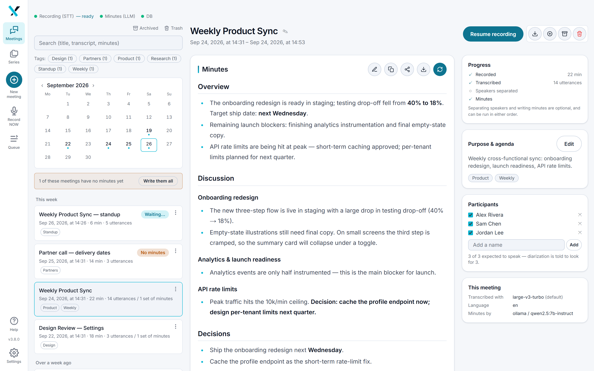

<div align="center">

# Voxinq Meeting

**Record meetings on your phone. Transcribe them, tell the speakers apart and write the minutes on your own PC. By default nothing leaves it.**

[**日本語ガイド →**](README.ja.md)


</div>

---

## Why Voxinq Meeting

Meeting-notes services ask you to upload the meeting to someone else's servers. Voxinq Meeting is
the same idea on hardware you own: **the phone records, your PC does the work**, and nothing is sent
anywhere unless you choose to send it.

| | **Voxinq Meeting** | A typical cloud notes service |
| --- | --- | --- |
| **Where the audio goes** | To your own PC, over your own private network. Sending recognition or minutes to an outside service is opt-in, per run, and the destination is named on screen | Uploaded to the vendor |
| **Who can read it** | Transcripts and minutes are encrypted per account — not even the machine's administrator can read them | Whoever holds the vendor's keys |
| **Cost** | Free. A consumer GPU (8 GB) is plenty, and it runs without one | Per user, per minute |
| **Models** | Your choice of Whisper model and LLM, local or remote, swapped at any time | Chosen by the vendor |

What else sets it apart:

- **The phone is a real recorder.** The Android app keeps recording with the screen off or another
  app in front, holds the audio through a dropped connection, rings at a booked meeting's time with
  **Record** in the notice, and turns a recording shared from any other app into a meeting.
- **Words while you speak**, on an NVIDIA GPU or Apple silicon — and it still works without either:
  the text arrives when the meeting ends.
- **Speakers, told apart and named.** Separation after the meeting, voices enrolled once and named
  in every meeting after, and a line two people spoke in divided at the word where the voice changed
  (80% → 96% of lines on the right speaker, on a measured meeting).
- **Minutes that remember.** A recurring series hands the previous minutes and a standing
  background to the next; you can ask a series "what were the TODOs from last time?", or ask a single
  meeting what was actually said.
- **One machine, several people.** Accounts, per-person encryption, and a queue that shares one GPU
  fairly — recording never waits for it.

## How it fits together


```mermaid
flowchart LR
    phone["📱 Phone<br/>records, reviews"]
    pc["🖥 Your PC<br/>transcribe → separate speakers → write minutes<br/>keeps the audio and the data"]
    phone -- "Tailscale (a private, encrypted network)" --> pc
```

The PC stays on during meetings; the phone connects to it. You can also use it from the PC's own
browser.

**Recommended:** a PC with an NVIDIA GPU, an Android phone, and Tailscale.

---

## Contents

1. [What you need](#1-what-you-need)
2. [Quick start](#2-quick-start)
3. [Check that it works](#3-check-that-it-works)
4. [Everyday use](#4-everyday-use)
5. [Features at a glance](#5-features-at-a-glance)
6. [When something is wrong](#6-when-something-is-wrong)
7. [Documentation](#7-documentation)

---

## 1. What you need

| | |
| --- | --- |
| **PC** | Windows, Linux or macOS, on during meetings |
| **GPU** | **Recommended:** NVIDIA, 8 GB VRAM or more. **Not required** (below) |
| **Disk** | About 40 GB free (about 20 GB without a GPU). The first run downloads a dozen or so GB of images and models |
| **Docker Desktop** | On the PC. Free |
| **Phone** | Android recommended — the app records with the screen off. An iPhone works through the browser (below) |
| **Tailscale** | On the PC and the phone. Free for personal use |

**Without an NVIDIA GPU** it runs on a Mac or any PC. What changes is **when** the text appears —
when the meeting ends instead of as you speak — and that writing the minutes takes longer (around a
quarter of an hour each on a CPU). See [what runs on what](docs/setup.md#what-runs-on-what). Neither
Mac route has been run on a real Mac yet ([what has actually been run](docs/setup.md#what-has-actually-been-run)).

**On an iPhone** the recording happens in the browser, and **can stop if the screen goes off**. Keep
the screen on (the page stops it from sleeping while recording), or use Android for long meetings.

---

## 2. Quick start

For a Windows PC with an NVIDIA GPU. Other machines, installing without the command line, and the
two installs that do not use Docker are in [Setup](docs/setup.md).

**① Install Docker Desktop and Tailscale on the PC, and Tailscale on the phone**

- [Docker Desktop](https://www.docker.com/products/docker-desktop/) — on an NVIDIA machine keep the
  default WSL2 backend
- [Tailscale](https://tailscale.com/download) — sign in with **the same account** on both

**② Turn on HTTPS in Tailscale, and find the PC's address**

In the admin console's [DNS page](https://login.tailscale.com/admin/dns), enable **MagicDNS** and
**HTTPS Certificates**. The PC's address has the form `<host>.<tailnet>.ts.net`; copy it from the
[machines list](https://login.tailscale.com/admin/machines).

**③ Fetch the two files**

```bash
mkdir voxinq
cd voxinq
curl -O https://raw.githubusercontent.com/ikasast/voxinq-meeting/release/docker-compose.yml
curl -o .env https://raw.githubusercontent.com/ikasast/voxinq-meeting/release/.env.example
```

**④ Set four values in `.env`**

```env
POSTGRES_PASSWORD="a password you choose"
DATABASE_URL="postgresql://voxinq:the-same-password@db:5432/voxinq"
TZ="Europe/London"
STT_WS_URL="wss://<host>.<tailnet>.ts.net:8443/ws"
```

- `STT_WS_URL` is where the phone reaches the transcription service. **Required to record from a phone.**
- Everything else can wait until you want it — [every variable](docs/configuration.md).

**⑤ Start it**

```bash
docker compose up -d
```

Without an NVIDIA GPU, fetch the CPU override and start with both files:

```bash
curl -O https://raw.githubusercontent.com/ikasast/voxinq-meeting/release/docker-compose.cpu.yml
docker compose -f docker-compose.yml -f docker-compose.cpu.yml up -d
```

**⑥ Fetch the model that writes the minutes**

```bash
docker compose exec ollama ollama pull qwen3:8b
```

An administrator can also download it from **Settings → LLM**.

**⑦ Make it reachable from the phone**

```bash
tailscale serve --bg --https=443 localhost:3000
tailscale serve --bg --https=8443 localhost:8000
```

> ⚠️ Port 8443, the transcription service, has no authentication. **Never publish it outside your
> tailnet** (Funnel or otherwise).

**⑧ Open it on the phone**

- **Android:** install `voxinq-<version>.apk` from [the latest release](https://github.com/ikasast/voxinq-meeting/releases/latest)
  and enter `https://<host>.<tailnet>.ts.net` when it asks
- **iPhone:** open `https://<host>.<tailnet>.ts.net/` in Safari, then add it to the home screen from
  the ⤓ icon at the top right

That is the install. After a restart, Voxinq comes back up with Docker Desktop (which starts at
sign-in by default).

---

## 3. Check that it works

Installed and usable in a meeting are not the same thing, so run one short meeting through from the
phone:

- [ ] Voxinq opens on the phone
- [ ] **New meeting** → **Set up meeting** → **Check the microphone** shows the level moving
- [ ] **Start recording** and speak — text appears (without a GPU, it appears after you stop)
- [ ] Finish with **Generate minutes** — the minutes appear on the meeting's page
- [ ] **Diarize** on the meeting's page — the lines are split by speaker

If separating speakers fails on an NVIDIA PC, it needs a Hugging Face token (`HF_TOKEN`) —
see [Speaker separation](docs/setup.md#speaker-separation). Without an NVIDIA GPU no token is needed.

Anything else: [When something is wrong](#6-when-something-is-wrong).

---

## 4. Everyday use



**Before the meeting.** Make sure the PC is on and open Voxinq on the phone. **New meeting** — an
agenda written in *Purpose & agenda* makes better minutes. A meeting booked for later waits under
**Upcoming**, and the Android app rings at its time.

**During it.** **Set up meeting** → **Check the microphone** → **Start recording**. The one failure
nothing can repair afterwards is a meeting nobody recorded, and the check takes ten seconds. When
recording in a browser, stay on the recording screen — leaving it stops the recording.

**After it.** Three ways to finish. Each lands on the meeting's page, and the work carries on on the
PC, so **the phone can be put away**.

| | |
| --- | --- |
| **Generate minutes** | finish and write the minutes (the usual choice) |
| **Diarize** | finish and separate the speakers first |
| **End only** | finish; do the rest later |

**Review.** Read and fix on the phone or the PC: correct a misheard line, fix a word misheard the
same way everywhere with **Find & replace**, regenerate the minutes in another format, and **ask** the
minutes a question.

| Recording | Minutes |
| --- | --- |
|  |  |

---

## 5. Features at a glance

| | |
| --- | --- |
| **Named speakers** | Enrol a voice once; it is named in every meeting after |
| **Series** | Recurring meetings share a background, regular members and the previous minutes |
| **Upcoming** | Book a meeting ahead; a banner (and the Android app) tells you when it starts |
| **Write them all** | Minutes for every meeting that has none, queued in one go |
| **From a file** | Drop a recording on New meeting — or share one to the Android app |
| **Suggest fixes** | Checks the transcript against your glossary, series name and members |
| **Translation** | A Japanese translation under each non-Japanese line, on the CPU |
| **Accounts** | Several people on one machine, each encrypted under their own key |
| **Export & backup** | Minutes as Markdown, Word or PDF; the whole instance to one file and back |
| **Read-only sharing** | One click publishes a password-protected link outside your tailnet |

The interface is in **English or Japanese**, following your browser or **Settings**. An empty meeting
list offers a **sample meeting** to learn on. More: [Usage & recipes](docs/usage.md).

---

## 6. When something is wrong

| Symptom | Check first |
| --- | --- |
| The phone cannot open it, or shows a blank page | Is Tailscale connected on the phone? Is the address `https://`? |
| No text while recording | Is `STT_WS_URL` right? Without a GPU, text arriving after you stop is normal |
| No minutes | Has `ollama pull` finished? **Settings → LLM** shows it |
| Separating speakers fails | On an NVIDIA PC, `HF_TOKEN` |
| No notice at a booked meeting's time | The Android app's notification permission, and that its battery setting is not *Restricted* |

More: [Troubleshooting](docs/troubleshooting.md).

---

## 7. Documentation

| I want to… | Read |
| --- | --- |
| **Install it** (every route, background services, phone access) | 📦 [Setup](docs/setup.md) |
| **Reach it from a phone / share read-only** (Tailscale, publish toggle, WireGuard) | 🌐 [Remote access](docs/remote-access.md) |
| **Change a setting** (every `.env` variable and `settings.json` option) | ⚙️ [Configuration](docs/configuration.md) |
| **Use a different LLM** (Ollama, vLLM, LM Studio, Anthropic, OpenAI, external GPU) | 🤖 [LLM providers](docs/llm-providers.md) |
| **Learn the features** (record, upload, diarize, find & replace, export, archive) | 📖 [Usage & recipes](docs/usage.md) |
| **Use the Android app** (install, updates, what it does) | 📱 [Android app](android/README.md) |
| **Understand how it works** (components, data flow, what is Voxinq and what is not) | 🏗 [Architecture](docs/architecture.md) |
| **Understand *why*** (the trade-offs, and what was tried and rejected) | 🧭 [Design decisions](docs/design-decisions.md) |
| **Fix a problem** (common issues and their causes) | 🩺 [Troubleshooting](docs/troubleshooting.md) |

Similar open-source projects: [Meetily](https://github.com/Zackriya-Solutions/meeting-minutes),
[Transcription Stream](https://github.com/transcriptionstream/transcriptionstream).

## License

Released under the [MIT License](LICENSE) — © 2026 ikasast. Third-party components ship under their
own licenses: [pyannote.audio](https://github.com/pyannote/pyannote-audio) models require accepting
their terms on Hugging Face (used only on an NVIDIA GPU), and Whisper and your chosen LLM are subject
to theirs. [NOTICE.md](NOTICE.md) covers what needs a word of its own, and each release lists every
package in its images with its licence.
