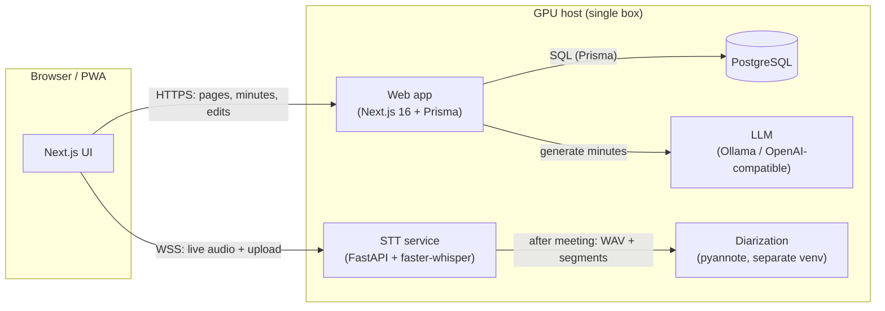

# Architecture

## Components

- **Web app** (`app/`, `lib/`) — Next.js 16 (React 19), Prisma. Serves pages and APIs;
  generates minutes via the LLM. Auth is handled by `proxy.ts` (Next.js 16 "proxy").
- **STT service** (`stt-service/server.py`) — FastAPI + faster-whisper. Streams live audio
  over WebSocket, saves the meeting WAV + utterance boundaries, and runs re-transcription and
  file-upload jobs.
- **Diarization** (`diarization/diarize.py`) — pyannote in its own venv (GPU torch), run as a
  subprocess after a meeting.
- **LLM** — Ollama by default, or any OpenAI-compatible / Anthropic endpoint.
- **PostgreSQL** — meetings, transcripts, minutes (versioned), tags.

## GPU time-sharing

Whisper (during a meeting) and the LLM (after) do not both stay resident on 8 GB VRAM. Voxinq
**releases Whisper on meeting end** so the LLM can run. A UI lock also prevents starting a
second GPU task (another minutes generation, transcription, or diarization) while one is
running.

## Data flow (recording)

1. Browser captures mic/PC audio → 16 kHz mono PCM via an AudioWorklet → **WebSocket to STT**
   (direct, lowest latency; the web app never proxies audio).
2. STT runs VAD + Whisper, streams back finalized utterances; the browser saves each to the DB.
3. On end, STT writes `recordings/<id>.wav` + `<id>.segments.json` for later diarization.
4. The web app calls the LLM with the transcript to produce the minutes.

## Data & retention

| Data | Where | Lifetime |
| --- | --- | --- |
| Meetings / transcripts / minutes | PostgreSQL | kept until deleted |
| Recording (WAV) | `stt-service/recordings/` | auto-delete after 7 days (protect to keep) |
| Trashed meetings | PostgreSQL (`deletedAt`) | purged after 30 days |
| Archived meetings | PostgreSQL (`archivedAt`) | kept; hidden from list, shown in search |
| Settings / API keys | `settings.json` (gitignored) | until changed |
