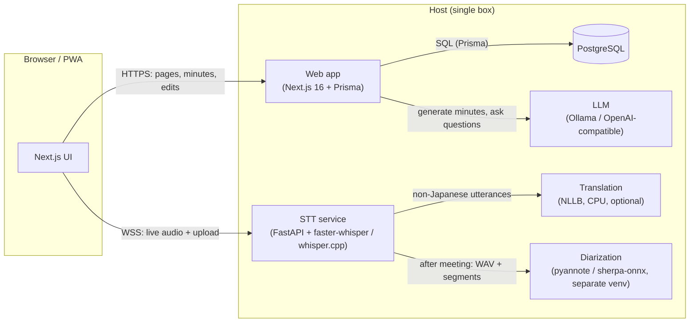

# Architecture

```mermaid
flowchart LR
  subgraph Browser["Browser / PWA"]
    UI["Next.js UI"]
  end
  subgraph Host["Host (single box)"]
    Web["Web app<br/>(Next.js 16 + Prisma)"]
    DB[("PostgreSQL")]
    STT["STT service<br/>(FastAPI + faster-whisper / whisper.cpp)"]
    TR["Translation<br/>(NLLB, CPU, optional)"]
    DIA["Diarization<br/>(pyannote / sherpa-onnx, separate venv)"]
    LLM["LLM<br/>(Ollama / OpenAI-compatible)"]
  end

  UI -- "HTTPS: pages, minutes, edits" --> Web
  UI -- "WSS: live audio + upload" --> STT
  Web -- "SQL (Prisma)" --> DB
  Web -- "generate minutes, ask questions" --> LLM
  STT -- "non-Japanese utterances" --> TR
  STT -- "after meeting: WAV + segments" --> DIA
```

## Components

- **Web app** (`app/`, `lib/`) — Next.js 16 (React 19), Prisma. Serves pages and APIs;
  generates minutes via the LLM. Auth is handled by `proxy.ts` (Next.js 16 "proxy").
- **STT service** (`stt-service/server.py`) — FastAPI, with **two recognition backends chosen
  from the hardware** (`backends.py`): faster-whisper where there is CUDA, whisper.cpp
  everywhere else. Where neither is accelerated, recognition is slower than speech, so the
  meeting is recorded and transcribed in one pass at the end instead of falling behind live
  (`live_transcription_available`). Streams live audio
  over WebSocket, saves the meeting WAV + utterance boundaries, and runs re-transcription and
  file-upload jobs. Sends provisional text while a sentence is still being spoken, then the
  final wording; recognition runs on a worker thread so the service stays responsive.
- **Translation** (`stt-service/translator.py`, optional) — NLLB-200 distilled via
  CTranslate2, **on the CPU**, so a Japanese translation of non-Japanese utterances can be
  produced while Whisper has the GPU. Off unless `sttTranslate` is enabled.
- **Diarization** (`diarization/diarize.py`) — **two backends, also chosen from the hardware**:
  pyannote (`speaker-diarization-community-1`, `DIA_MODEL` to override) where there is CUDA,
  sherpa-onnx everywhere else. Own venv, run as a subprocess after a meeting. `DIA_BACKEND`
  forces one. See [design decisions](design-decisions.md#diarization-has-two-backends-chosen-by-the-hardware)
  for why both exist.
- **LLM** — Ollama by default, or any OpenAI-compatible / Anthropic endpoint. Generates
  minutes, and answers questions asked against a series' minutes (`lib/llm/ask.ts`).
- **PostgreSQL** — meetings, transcripts, minutes (versioned), tags.

## GPU time-sharing

On a machine with one CUDA card of about 8 GB — which is what Voxinq was written on. A host
without a GPU has no VRAM to arbitrate; the same lock still serialises the work, but what is
being shared is CPU time.

Whisper (during a meeting) and the LLM (after) do not both stay resident on 8 GB VRAM. Voxinq Meeting
**releases Whisper on meeting end** so the LLM can run. A UI lock also prevents starting a
second GPU task (another minutes generation, transcription, or diarization) while one is
running.

## Data flow (recording)

1. Browser captures mic/PC audio → 16 kHz mono PCM via an AudioWorklet → **WebSocket to STT**
   (direct, lowest latency; the web app never proxies audio).
2. STT segments the stream with an **energy-based VAD** (`VAD_*` settings) to find utterance
   boundaries, then recognizes each segment with Whisper — which applies its own **Silero VAD**
   (`vad_filter`) inside the segment to suppress silence hallucinations. Provisional text is
   streamed first, then the final wording; the browser saves each utterance to the DB.
3. On end, STT writes `recordings/<id>.wav` + `<id>.segments.json` for later diarization.
4. The web app calls the LLM with the transcript to produce the minutes.

## Data & retention

| Data | Where | Lifetime |
| --- | --- | --- |
| Meetings / transcripts / minutes | PostgreSQL | kept until deleted |
| Recording (WAV) | `stt-service/recordings/` | auto-delete after 7 days (protect to keep) |
| Trashed meetings | PostgreSQL (`deletedAt`) | purged after 30 days |
| Archived meetings | PostgreSQL (`archivedAt`) | kept; hidden from list, shown in search |
| Series (name + per-series defaults) | PostgreSQL (`series`) | removed automatically with its last meeting |
| Voice profiles (voiceprints) | PostgreSQL (`speaker_profiles`) | until deleted in Settings → Speakers |
| Settings / API keys | `settings.json` (gitignored) | until changed |

## Why it is built this way

The reasoning behind the choices above — and the alternatives that were tried and rejected —
is on its own page: **[Design decisions](design-decisions.md)**.

---

[Docs index](README.md) · [← Usage & recipes](usage.md) · Next: [Troubleshooting →](troubleshooting.md)
