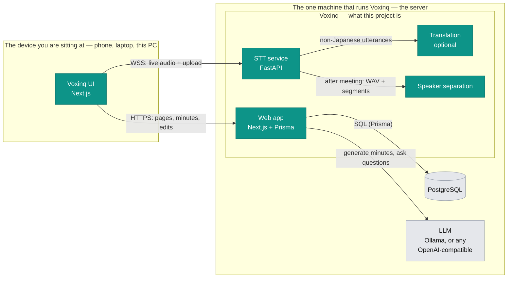

# Architecture

```mermaid
flowchart LR
  subgraph Browser["The device you are sitting at — phone, laptop, this PC"]
    UI["Voxinq UI<br/>Next.js"]
  end
  subgraph Host["The one machine that runs Voxinq — the server"]
    subgraph Vox["Voxinq — what this project is"]
      Web["Web app<br/>Next.js + Prisma"]
      STT["STT service<br/>FastAPI"]
      TR["Translation<br/>optional"]
      DIA["Speaker separation"]
    end
    DB[("PostgreSQL")]
    LLM["LLM<br/>Ollama, or any<br/>OpenAI-compatible"]
  end

  UI -- "HTTPS: pages, minutes, edits" --> Web
  UI -- "WSS: live audio + upload" --> STT
  Web -- "SQL (Prisma)" --> DB
  Web -- "generate minutes, ask questions" --> LLM
  STT -- "non-Japanese utterances" --> TR
  STT -- "after meeting: WAV + segments" --> DIA

  classDef own fill:#0d9488,stroke:#0f766e,color:#fff
  classDef ext fill:#e5e7eb,stroke:#9ca3af,color:#111
  class UI,Web,STT,TR,DIA own
  class DB,LLM ext
```

**The two boxes are two different computers.** Everything on the right runs on one machine you
control — the server. On the left is whatever you are actually using: a phone, a laptop, or that
same machine's own browser. They are often the same box on a desk, and the diagram separates
them because the distinction is what makes phone recording work: audio goes from the browser
**straight to the STT service**, never through the web app, so the only thing crossing the
network is the recording itself. It stops there unless you have chosen an endpoint to recognise
with, in which case the STT service — not the browser — is what posts the audio on.

The UI is shaded as Voxinq's code even though it sits on the left: it is this project's code,
delivered to and run by your browser.

**Shaded is Voxinq's own code; grey is software it runs but does not replace.** The recognition
itself is third-party too — the STT service is a wrapper that picks between faster-whisper and
whisper.cpp, and speaker separation between pyannote and sherpa-onnx, from what the machine can
run. Voxinq supplies the recording, the segmentation, the storage, the minutes and the UI
around them.

What comes with an install differs by route rather than by this boundary: Docker brings
PostgreSQL *and* Ollama up as containers, the `voxinq` launcher bundles PostgreSQL but
[deliberately leaves Ollama alone](design-decisions.md#the-launcher-bundles-a-database-and-manages-nothing-else),
and a native install expects both already there.

## Components

- **Web app** (`app/`, `lib/`) — Next.js 16 (React 19), Prisma. Serves pages and APIs;
  generates minutes via the LLM. Auth is handled by `proxy.ts` (Next.js 16 "proxy").
- **STT service** (`stt-service/server.py`) — FastAPI, with **two local recognition backends
  chosen from the hardware** (`backends.py`): faster-whisper where there is CUDA, whisper.cpp
  everywhere else. Two more exist for recognising somewhere else — one OpenAI-compatible, one
  for Google Gemini — and neither is ever chosen at startup: they arrive with the job, because
  where the audio goes is a decision that belongs in one place. Where neither is accelerated, recognition is slower than speech, so the
  meeting is recorded and transcribed in one pass at the end instead of falling behind live
  (`live_transcription_available`). Streams live audio
  over WebSocket, saves the meeting WAV + utterance boundaries, and runs re-transcription and
  file-upload jobs. Sends provisional text while a sentence is still being spoken, then the
  final wording; recognition runs on a worker thread so the service stays responsive.
- **Translation** (`stt-service/translator.py`, optional) — NLLB-200 distilled via
  CTranslate2, **on the CPU**, so a Japanese translation of non-Japanese utterances can be
  produced while Whisper has the GPU. Off unless `sttTranslate` is enabled.
- **Diarization** (`diarization/diarize.py`) — **two backends, also chosen from the hardware**:
  pyannote (`speaker-diarization-community-1`, `DIA_MODEL` to override) where there is CUDA,
  sherpa-onnx everywhere else. Own venv, run as a subprocess after a meeting. `DIA_BACKEND`
  forces one. See [design decisions](design-decisions.md#diarization-has-two-backends-chosen-by-the-hardware)
  for why both exist.
- **LLM** — Ollama by default, or any OpenAI-compatible / Anthropic endpoint. Generates
  minutes, and answers questions asked against a series' minutes (`lib/llm/ask.ts`).
- **PostgreSQL** — meetings, transcripts, minutes (versioned), tags.

## GPU time-sharing

On a machine with one CUDA card of about 8 GB — which is what Voxinq was written on. A host
without a GPU has no VRAM to arbitrate; the queue still serialises the work, but what is being
shared is CPU time.

Whisper (during a meeting) and the LLM (after) do not both stay resident on 8 GB VRAM. Voxinq Meeting
**releases Whisper on meeting end** so the LLM can run.

## The job queue

Minutes, diarization and re-transcription are rows in a `jobs` table rather than work the
browser drives, which is why closing a tab no longer abandons a run.

- **Claiming** — `lib/queue/queue.ts` takes the next job with `FOR UPDATE SKIP LOCKED`, so two
  processes cannot claim the same one. A job is admitted when its estimated VRAM plus what is
  already running fits the budget; a job larger than the whole budget runs alone rather than
  never.
- **Pricing** — `lib/queue/capacity.ts` estimates each job when it is queued. An Ollama model
  is costed by asking Ollama, plus a fifth for context. Work sent to a cloud model or a remote
  endpoint costs **zero**; a whisper server on *this* machine is costed as the local model,
  because "over HTTP" does not mean "somewhere else".
- **Budget** — `vramBudgetMb` when set, otherwise the card's total (from `nvidia-smi`, reported
  on `/health`) less 1 GB of headroom, or 4 GB where there is no NVIDIA card.
- **Dispatching** — `lib/queue/dispatcher.ts` ticks every 2 s from `instrumentation.ts`, and
  re-ticks 50 ms after a claim so a zero-cost job can start beside what it just admitted. It
  holds an `AbortController` per running job, which is what Stop uses.
- **Recovery** — jobs left `running` by a process that is gone are requeued at startup.

### Recordings hold the card

A live recording is not scheduled — it starts when someone presses a button — but it needs the
GPU as much as anything queued. It takes a row of `kind = "recording"`, already `running`, so
admission control sees the card is occupied without knowing anything about recordings.

Starting a recording while something is on the GPU asks whether to interrupt it (the running
job is requeued at the front) or to record without live recognition. The STT service takes a
per-session `live` flag for the second case; it only ever narrows, so a host that cannot keep
up does not start doing so because a client asked.

Releasing the hold has three paths and a backstop: the meeting ending, the screen unmounting,
`pagehide` — and, for a browser that is killed outright, a sweep that asks the STT service
which meetings still have a live connection (`POST /activity`). The sweep releases only what it
can confirm, and never a hold younger than 90 s. Restart recovery skips recordings, because a
recording survives the web app restarting.

## Data flow (recording)

1. Browser captures mic/PC audio → 16 kHz mono PCM via an AudioWorklet → **WebSocket to STT**
   (direct, lowest latency; the web app never proxies audio).
2. STT segments the stream with an **energy-based VAD** (`VAD_*` settings) to find utterance
   boundaries, then recognizes each segment with Whisper — which applies its own **Silero VAD**
   (`vad_filter`) inside the segment to suppress silence hallucinations. Provisional text is
   streamed first, then the final wording; the browser saves each utterance to the DB.
3. On end, STT writes `recordings/<id>.wav` + `<id>.segments.json` for later diarization.
4. The web app calls the LLM with the transcript to produce the minutes.

Re-transcription takes the same path from step 3: the web app posts the job to STT, attaching
the chosen endpoint and its key if the run is going somewhere else, and STT rewrites both the
utterances and `segments.json` — they have to stay the same length, because diarization maps
speakers onto utterances by index.

## Data & retention

| Data | Where | Lifetime |
| --- | --- | --- |
| Meetings / transcripts / minutes | PostgreSQL | kept until deleted |
| Recording (WAV) | `stt-service/recordings/` | auto-delete after 7 days (protect to keep) |
| Trashed meetings | PostgreSQL (`deletedAt`) | purged after 30 days |
| Archived meetings | PostgreSQL (`archivedAt`) | kept; hidden from list, shown in search |
| Series (name + per-series defaults) | PostgreSQL (`series`) | removed automatically with its last meeting |
| Voice profiles (voiceprints) | PostgreSQL (`speaker_profiles`) | until deleted in Settings → Speakers |
| Settings / API keys | `settings.json` (gitignored) | until changed |

## Why it is built this way

The reasoning behind the choices above — and the alternatives that were tried and rejected —
is on its own page: **[Design decisions](design-decisions.md)**.

---

[Docs index](README.md) · [← Usage & recipes](usage.md) · Next: [Troubleshooting →](troubleshooting.md)
