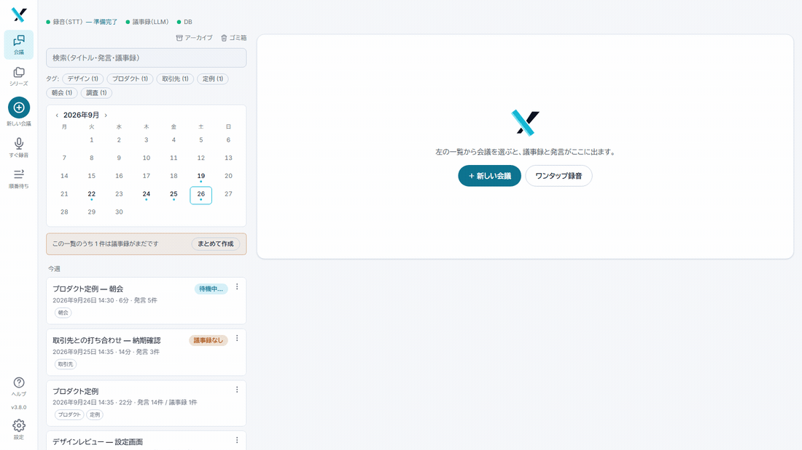
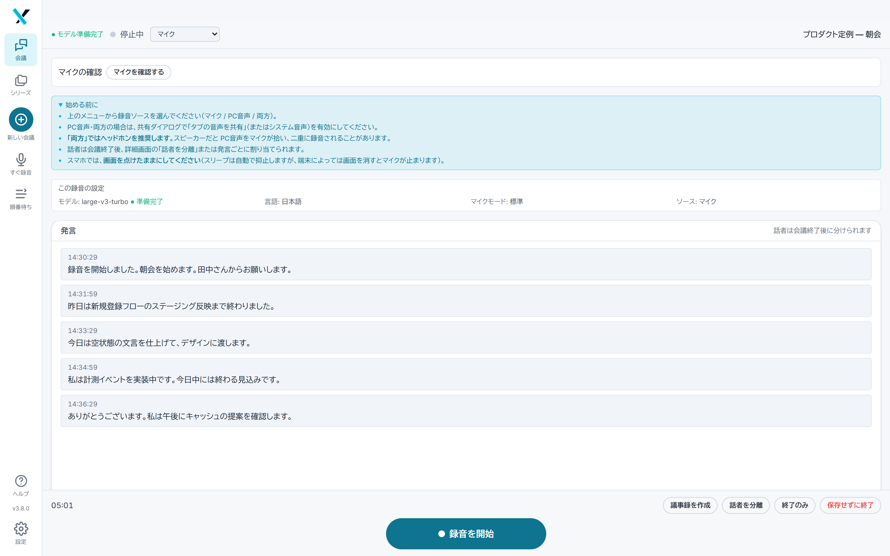
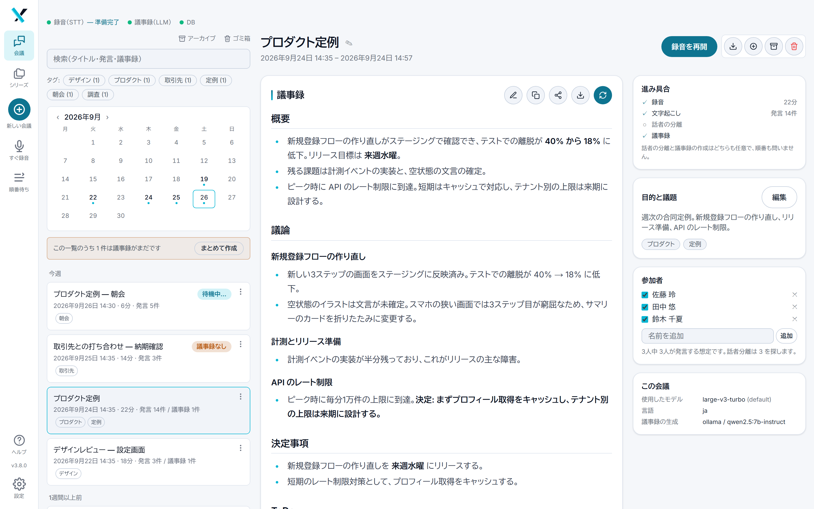
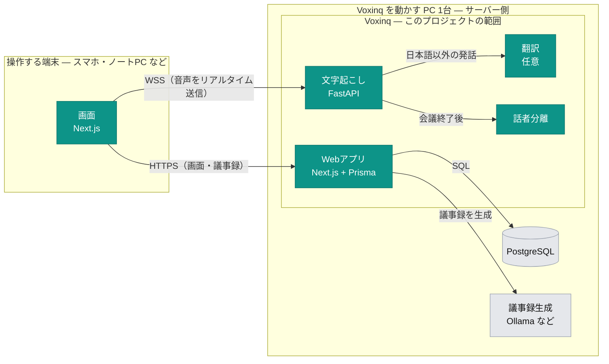

# 機能の説明

録音から議事録までの流れ、各機能、設定画面、仕組み。 [← 日本語ガイドに戻る](../../README.ja.md)

## 何ができるアプリか

ブラウザで会議を録音すると、次の3つが**すべて自分のPCの中で**自動的に行われます。

| ステップ | 使う技術 | 内容 |
| --- | --- | --- |
| ① 文字起こし | faster-whisper / whisper.cpp | NVIDIA GPU・Apple Silicon なら話しながらリアルタイムで文字が出ます（それ以外は会議終了時にまとめて） |
| ② 話者分離 | pyannote / sherpa-onnx | 「誰が話したか」を会議後に自動で振り分けます |
| ③ 議事録作成 | ローカルLLM（Ollama など） | 要約・決定事項・TODO を自動生成します |

①②は**機器に応じて自動でエンジンが選ばれます**（→ [GPU の種類による違い](setup.md#gpu-の種類による違い)）。

さらに、できあがった議事録に対して**「前回までのTODOを教えて」と質問**したり、
外国語の会議に**日本語訳を並べて表示**したりできます（いずれもローカルで完結）。

## こんな人におすすめ

- **会議の内容を外部に出せない方** — 研究・法務・人事・経営戦略など、クラウドの文字起こしサービスに音声をアップロードできない場面で使えます
- **議事録作成に時間を取られている方** — 会議終了と同時に議事録の生成が始まります
- **手元にゲーミングPCがある方** — VRAM 8GB のGPUがあれば十分動きます
- **月額課金を避けたい方** — 自分のPCで動くので、何時間録音しても無料です
- **GPU が無い方も** — Mac でも、GPU の無い PC でも動きます。変わるのは「文字が出るタイミング」
  だけです。ただし**文字起こしの中身は CUDA 機と同一にはなりません**（→ [GPU の種類による違い](setup.md#gpu-の種類による違い)）

逆に、PC を常時起動しておけない場合は、クラウドサービスの方が手軽です。

## 基本的な使い方



### 会議を録音して議事録を作る

1. **「+ New」** をクリックして会議を作成します
   - 「目的と議題」に議題を書いておくと議事録の精度が上がります
   - 「Recording settings」で、この会議だけの文字起こしモデル・言語・マイク設定を選べます
2. **「会議を準備する」** を押します — 会議が作られ、録音画面が開き、**文字起こしモデルの読み込みが始まります**
   （この時点ではまだ録音は始まりません）
3. **マイクを確認します** — 録音ボタンの上の「マイクの確認」で **マイクを確認する** を
   押すと、マイクが開いてレベルが動き、音が届いているかが分かります
   - **このアプリで最も高くつく失敗は「録音できていなかった」**です。議事録の作り直しも話者の
     付け直しも後からできますが、録らなかった会議だけは取り返せません
   - ミュートのままのヘッドセット、OS が勝手に切り替えた入力、マイクを掴んでいる別アプリ —
     どれも文字起こしが空で返ってくるまで正常に見えます。10秒で確かめられます
   - ここで開いたマイクは**そのまま録音に引き渡されます**。許可ダイアログが二度出ることも、
     録音が別の入力を開いてしまうこともありません。1分で自動的に閉じ、確認せずに録音を始めても
     従来どおり動きます
   - ソースやマイクモードを変えると確認結果は破棄されます（要求する設定が変わるため）
4. 上のバーが **「● モデル準備完了」** になったら、**画面下端の大きな「録音を開始」**で録音開始
   - モデルの初回読み込みには数十秒かかります。準備できたかが表示で分かります
   - 話すと**1〜2秒遅れでグレーの文字が出て**、区切りで確定した文章に置き換わります
   - GPU 加速の無い機器では、上のバーが **「会議の終了後に文字起こしします」** に
     なります。会議中は録音だけを行い、文字は終了時にまとめて出ます
   - **開始・停止は下端**にあります。スマホで片手で押せる位置に置くためで、状態表示・入力レベル・
     録音ソースは「見るもの」なので上に残しています
   - マイクチェックの下の注意書きは、録音開始で畳まれます（開き直せばそのままです）
   - **他の処理が GPU を使っていても録音は待たされません。** 議事録生成・話者分離・
     文字起こしのやり直しが動いていると、何が動いているかを示して 2 択を聞かれます

     | 選択 | 動作 |
     | --- | --- |
     | **中断して会議中に文字起こし** | 動いていた処理を中断し、この会議をリアルタイムで文字起こしします。中断された処理は[キュー](#キュー会議中に待たされないための仕組み)の**先頭**に戻り、会議終了後にやり直されます |
     | **録音だけする** | 動いていた処理をそのままにします。**音声は保存され、会議終了後に文字起こしされます**（失われるものはありません）。会議中は状態表示の横に **録音のみ** と出ます |

     どちらを選んでも録音自体は行われるので、これは「拒否」ではなく「質問」です。クラウドの
     モデルや外部エンドポイントに送る処理は GPU を使わないため、この質問は出ません
5. 会議が終わったら、**終了方法を3つから選びます**（主ボタンのすぐ上に並んでいます）

| ボタン | 動作 | こんなときに |
| --- | --- | --- |
| **議事録を作成** | 議事録の生成を開始して終了 | 通常はこれでOK |
| **話者を分離** | 話者分離を実行して終了 | 複数人の会議で「誰の発言か」を先に整理したいとき |
| **終了のみ** | 終了だけ | 後でまとめて処理したいとき |

どれを選んでも**その会議の詳細画面に移動**します。議事録はバックグラウンドで生成されるので、
**画面を閉じても大丈夫**です。

会議中に文字が出ていなかった場合（終了時にまとめて文字起こしする機器や、「録音だけする」を
選んだとき）は、終了すると文字起こしがキューに入り、議事録の作成や話者分離はその後に続きます。
詳細画面には文字起こしの順番待ち・処理中の様子が出ます。こちらも画面を閉じて構いません。

> ⚠️ 録音画面には、他ページへのリンクをあえて置いていません。**録音中に他の画面へ移動すると
> 録音が止まります。** 終了は必ず上の3つのボタンから行ってください。

> **スマホの電池対策：休止画面**
> 録音中は画面が消えないようにしています（消えるとマイクが止まる機種があるため）。その画面が
> 電池を食うので、**画面を真っ暗にしたまま録音を続ける**ことができます。上のバーの
> **「画面を消す」** で即座に、または **設定 → 表示** で 30秒・1分・5分・10分の
> 無操作後に自動で切り替わります（既定は「Never」）。タップで戻り、また同じ時間で休止します。
> **録音は一切止まりません**（画面ロック・マイク・アップロードはすべて継続、経過時間も動き続けます）。
> 有機ELの画面では黒い画素が光らないため効果が大きく、液晶ではバックライトが残るので限定的です。
> 休止中は**リアルタイムの文字起こしが見られない**のが引き換えです。
>
> **Android アプリならこの制約はありません。**録音をアプリのサービスが持つので、画面を消しても、
> 他のアプリに切り替えても録音は続きます（[Android アプリ](setup.md#android-アプリ画面を消しても録音が続く)）。

### キュー：会議中に待たされないための仕組み

**議事録の生成・話者分離・文字起こしのやり直し**は GPU を使うため、順番に実行されます。
その順番を見るのが上部メニューの **順番待ち** です。

- GPU が空くのを待ってからボタンを押す必要はありません。**押せばキューに積まれ、順番に走ります**
- **タブを閉じても処理は続きます**（サーバー側で動いているため）。以前はブラウザが処理を
  見張っていたので、閉じると結果が反映されませんでした
- 待機中の行は **↑ / ↓** で順番を変えられます。実行中の行は動かせません
- **停止**（実行中）/ **削除**（待機中）で取り消せます。取り消した処理は自動では
  やり直されません
  - ただし**文字起こしのやり直しだけは、STT 側で走り始めた認識処理を止める手段がありません**。
    キューからは消えますが処理自体は最後まで走り、結果が捨てられます（その旨が表示されます）
- **GPU 外** と出ている行は、処理が別の場所（クラウドのモデルや外部エンドポイント）で
  行われるものです。GPU を使わないので順番待ちをせず、他の処理と同時に走ります
- 同時に何個走るかは「個数」ではなく**必要な VRAM の合計**で決まります。設定は
  **設定 → 文字起こし** の `vramBudgetMb`（空欄なら GPU から自動計算）
- **録音中もこの一覧に出ます**。会議中に大きな処理が裏で始まらないのはこのためです
- 一覧の下の **履歴** に、終わった処理が新しい順に並びます。「なぜあれは遅かったのか」を
  振り返るためのもので、各行に**会議の長さ・待ち時間・処理時間**と、何で動いたかが出ます
  - **議事録**：モデル、**GPU にどれだけ載ったか**（処理終了時に実測。一部が CPU にはみ出すと
    「GPU 84% / CPU 16%」と警告色で出ます。議事録が極端に遅いときの原因はたいていこれです）、
    入力・出力トークン数と生成速度、モデルの読み込み時間、長い会議を分割して書いた場合はその回数
  - **話者分離**：方式（pyannote / sherpa-onnx）、GPU か CPU か、見つかった話者数、分割した行数
  - **文字起こしのやり直し**：モデルと、外部エンドポイントを使った場合はその名前
  - 失敗した処理には理由が出ます。見えるのは自分の履歴だけで、管理者はマシン全体の履歴を
    見られます（他人の行は会議名や失敗理由を伏せ、処理の種類・人・数値だけ）。この機能より前の
    処理には時刻だけが出ます

| 録音中 | 議事録 |
| --- | --- |
|  |  |

### 既存の録音ファイルから議事録を作る

録音済みのファイルがある場合は、**「新しい会議」画面に音声ファイルをドラッグ＆ドロップ**するだけです。
文字起こし → 議事録作成が自動で進みます。（wav / mp3 / m4a などに対応）
ファイルはサーバーに送られ、どちらの工程もサーバーのキューで順に進むので、アップロードが終われば
タブを閉じて構いません。進み具合は会議のページに出ます。

**Android では、他のアプリから「共有」で送れます。**ボイスレコーダーのファイルや、チャットで受け取った
録音を共有メニューから Voxinq に渡すと、確認が 1 回出て、新しい会議として送信されます。文字起こしは
サーバーのキューで進むので、送信が終わればスマホをしまって構いません。残った通知をタップすると会議が開きます。
続けて何件共有しても 1 件ずつ順に送られ、通知もそれぞれに残ります。
こちらは**議事録を自動では作りません**（まとめて作るのは[下の機能](#議事録をまとめて作る)が向いています）。

## 便利な機能

### 話者を自動で名前付けする（声紋登録）

一度声を登録しておくと、**以降の会議では自動的にその人の名前が付く**ようになります。

**自分の声を登録する場合**
「設定」→「話者」タブ → 名前を入力 → 表示された文章を20〜30秒読み上げるだけです。

**他の参加者を登録する場合**
会議の詳細画面で話者分離を実行 → 各話者に名前を付ける → 「声紋を登録」を押します。
※ 録音データ（WAV）が残っている会議でのみ可能です（7日で自動削除されるため注意）。

> **同じ人を何度登録しても上書きされません。** 登録するたびに過去の録音と**平均**され、
> 声紋は「これまで登録した全録音の重心」になります。部屋・マイク・声の調子の違いを吸収するので、
> **回数を重ねるほど照合が安定します**（1回の悪い録音で台無しになりません）。
> 2件以上登録された人には設定画面で `×N` と表示されます。やり直したい場合は削除してから再登録してください。

### 参加者を登録する（話者分離の精度が上がります）

会議画面の右側に、その会議にいた人を登録できます。**声紋を登録済みの人はボタンで並ぶので、
触れればその場で追加されます**（`+ 田中` のような表示）。未登録の人は下の入力欄に書いてください。

**チェックは「参加したか」ではなく「発言する見込みがあるか」です。** ここが効きます。

- **チェックした人数が、話者分離に渡す話者数になります。** 話者分離が一番外すのは人数の推定
  なので、これが分かっているだけで精度が変わります
- **チェックした名前が、声紋による自動命名の候補になります。** 登録しないと全プロフィールが
  候補になるため、**その場にいなかった人の名前が付く**可能性が残ります

会議には出たが一言も話さなかった人は、**名簿に残したままチェックだけ外して**ください。名簿から
消す必要はありません。

チェックを間違えても「話者を分離」は何度でも実行できます。ただし**実際より少なく伝えると 2 人が
1 人に統合される**ので、迷ったらチェックを付けたままにしてください。

### 1 行に 2 人の発言が入ったとき（行の分割）

文字起こしの行は**声が途切れたところで区切られ、話者が変わったところでは区切られません。**そのため
「…でよろしいですか？」「はい」のような短いやり取りが 1 行に入り、以前は行ごと多く話した方の発言に
なっていました。話者分離は単語ごとの時刻を使って声が変わった位置を見つけ、**その行を人ごとに分けます**。
計測した会議では、正しい話者が付いた行の割合が 80% から 96% に上がりました。

- **「分割を元に戻す」**（「話者を分離」の隣）で、分けた行をすべて元の 1 行に戻せます。何かが
  分けられたときだけ表示されます
- **手で編集した行は分けません**。認識時の単語と内容が合わなくなっており、分けると編集が消えるためです
- 単語の時刻を出せるのは **faster-whisper（NVIDIA GPU）だけ**です。whisper.cpp や外部の認識先で
  認識した会議と、3.8.0 より前に録音した会議は、従来どおり行ごとに話者が付きます
- 分けた行の**翻訳は消えます**（翻訳は元の 1 行全体に対するものだったため）

### 会議を予定として先に入れておく

「新しい会議」画面の **日時** に日時を入れると、録音せずに会議だけを作れます。一覧の上部に
**予定** として並び、当日は開いて「録音画面」を押すだけです。

タイトル・議題・シリーズ・参加者・使用モデルは、**全員が待っている開始直前ではなく、落ち着いた
ときに**決められます。空欄のままなら従来どおり、作成してそのまま録音が始まります。

表示される日時は予定した日時です。録音が終わると、実際に録音が始まった時刻に補正されます
（火曜に予定して水曜に録った会議が「火 14:00 – 水 15:20」と表示されないようにするためです）。

**時刻になると知らせます。**開いているページの上部に、会議名と「録音を開始」のバーが出ます
（許可すれば OS の通知も）。ただしブラウザかアプリが**開いている間だけ**です。
**Android アプリ**は何も開いていなくても、その時刻にスマホ自身が通知し、通知の「録音」からその会議の
録音が始まります（[Android アプリ](setup.md#android-アプリ画面を消しても録音が続く)）。

### 定例会議をまとめる（シリーズ機能）

毎週の定例など、継続的な会議は**シリーズ**にまとめられます。

- 一覧では**1件ずつ個別に並びます**（v3 で変更）。週次の会議 4 件は 4 件の会議であり、
  束ねると「探してスクロールしている当の古い回」が隠れてしまうためです
- カードの **↻ チップ**を押すと、**そのシリーズだけに絞り込めます**（件数と「show all」で復帰）。
  絞り込み中はカレンダーが隠れます — 「どの会議か」はシリーズが既に答えているためです
- 議事録を作るとき、**前回の議事録がAIに参考情報として渡される**ので、「前回の続きですが」といった発言も正しく解釈されます
- シリーズごとに**議事録のフォーマットや専門用語集を設定**できます。**シリーズページ**は会議詳細の
  右側の欄（および「アーカイブ」ページ）の ↻ から開きます — 一覧のチップは絞り込み用です

### 議事録に質問する

シリーズ名（↻）をクリックして開くシリーズページに、**質問欄**があります。

- 「**前回までのTODOを教えて**」「未解決の論点は？」のように聞くと、そのシリーズの**全回の議事録**を
  根拠に、**どの回（日付・会議名）のものか**を明記して答えます
- 根拠は議事録だけです。書かれていないことは推測せず「議事録には記載がありません」と答えます
- 回答の下に「何件の議事録を見たか／長さの都合で除外した古い回／議事録がまだ無い回」が表示されます
- **シリーズに入っていない単発の会議**は、その会議自体を「1回だけのシリーズ」として扱い、
  会議詳細に同じ質問欄が出ます（シリーズ内の個々の会議には出ません）
- 回答はGPUを使うため、議事録の生成中は実行できません。**回答は保存されません**

**単発の会議では、発言そのものにも質問できます。**質問欄の **「議事録から／文字起こしから」** を
切り替えると、議事録ではなく**その会議で話されたことすべて**を根拠に答えます。「予算について
誰が何と言ったか」のように、議事録には残らない細部向けです。発言に無いことは「記録には見当たりません」と
答えます。**議事録がまだ無い会議でも、発言があれば質問欄が出ます**。長い会議は、モデルに
入りきる量まで要約してから答えるので、その分時間がかかります。

### 外国語の発言に日本語訳を付ける

「設定」→「文字起こし」→ **「日本語以外の発言に日本語訳を付ける」** をオンにすると、
**日本語以外の発言の下に日本語訳**が並びます（会議中も、あとから見る発言ログでも）。

- 日本語の発言はそのままです。**議事録は原文から作られます**（訳文は表示用）
- 翻訳は**CPUで動く**ので、GPUの文字起こしと取り合いになりません
- 初回オン時に約600MBの翻訳モデルをダウンロードします。このモデルは
  **CC-BY-NC（非商用利用のみ）** のため、既定ではオフになっています

### 発言を修正・削除する

発言ログの各行に **✎（編集）** と **🗑（削除）** があります（PCはマウスを乗せると表示、スマホは常時表示）。

- **✎ 編集** — 人名や専門用語の聞き間違いをその場で直せます。会議全体を再文字起こしせずに、
  **正しい言葉で議事録を作り直せます**。Enterで保存、Shift+Enterで改行、Escで取り消し
- **🗑 削除** — 幻聴（ハルシネーション）やマイクトラブルによる変な行を、**議事録生成の入力から外します**。
  録音データ自体は残ります

※ 編集は話者分離に影響しません（並び順が変わらないため）。削除は並びが変わるので、
録音側とのズレが起きた場合は「話者分離をやり直してください」と警告が出ます。

### 同じ誤変換をまとめて直す（検索・置換）

固有名詞が会議中ずっと同じ形で誤認識されることがあります。40 箇所の「ボクシンク」を
Voxinq にする、といった修正は 1 件ずつ直す必要はありません。

発言一覧の下にある **検索と置換** の行を開き、語句と置換後を入力して **プレビュー** を押すと
「何件が該当するか」と最初の数件の前後が表示されます。**押すまでは何も書き換わりません**。

- 既定では大文字小文字を区別しません（**大文字小文字を区別** で区別する）。置換後は入力したとおりに
  書かれるので、`voxinq` を探して `Voxinq` に置換すれば `VOXINQ` も直ります
- 語句は**ただの文字列**で、正規表現ではありません。`(JPY)` はその文字そのものを探します
- 置換の結果が**空になる発言はスキップ**されます。削除は録音側の区切りも動かす操作なので、
  行の 🗑 から明示的に行う形にしてあります
- 言い換えは話者分離に影響しません（位置がずれるのは発言を削除したときだけです）

### 議事録を作り直す

内容が気に入らない場合、**↻ボタン**から再生成できます。その際に選べるのは:

- **詳細度** — 簡潔（brief）／標準（standard）／詳細（detailed）
- **使用するAI** — Ollama／Anthropic／OpenAI互換
- **フォーマット** — 設定 → 議事録 に保存した見出し構成から選べます。**講演は会議ではない**ので、
  同じ見出しで書かせると中身の無い節ができます。用途ごとに保存しておいて、生成時に選ぶ形です
  （シリーズに専用フォーマットがある場合は、ここで選ばない限りそちらが優先されます）

過去のバージョンは残るので、**見比べてから選べます**。

### 議事録をまとめて作る

学会や研修のように、**その場では録音だけ続けて、議事録は後で作る**日のための機能です。

- 終了して発言があり、議事録がまだの会議には、一覧で **「議事録なし」** の印が付きます
- 一覧の上に「この一覧のうち N 件は議事録がまだです」と出ます。**「まとめて作成」** で対象が
  並び（最初は全件選択済み）、**「N 件をキューに送る」** で順番待ちに積まれます
- 生成はサーバーのキューで 1 件ずつ進むので、**ページを閉じても構いません**。すでにキューにある会議は
  対象に出ないので、二重に積まれることはありません
- **「書式・詳細度・モデル…」** を開くと、**今回のまとめて作成だけ**書式（テンプレート）・詳しさ・
  生成元を選べます。詳細画面の「作り直す」と同じで、**保存済みの設定は変わりません**。開かずに送れば、
  各会議は単独で作るときと同じ設定（シリーズ独自の書式も含む）で書かれます

### 一覧の見方とカレンダー

- **予定** の下は、**今週 / 1週間以上前 / 1か月以上前**で仕切られています。日付を読まなくても
  「最近かどうか」が分かります。並び順は**実際に会議が行われた日時**（行が作られた日時ではありません）
- **「アーカイブ」と「ゴミ箱」は一覧の上**にあります。しまったものを探すのに、しまっていないものを
  全部スクロールする必要は無いはずなので
- **カレンダー**が一覧の上にあります
  - 会議のある日にドット（**最大3個**）。今日は枠線、選択中の日は塗り
  - 日を押すとその日だけに絞り込み、**もう一度押すと解除**されます（同じセルが行きと戻りを兼ねます）
  - **‹ ›** で月移動、**今日** で戻ります。ドットは表示中の月を直接数えているので、
    一覧に載っていない過去の月でも正しく出ます
  - **「+ Add a meeting on this day」はどの日にも出ます**。すでに3件ある日こそ4件目が入る日なので、
    空き日を特別扱いしていません。押すと *新しい会議* が **日時が入力済み**で開きます
  - 検索中とシリーズ絞り込み中は隠れます

### 整理する（検索・タグ・アーカイブ）

- **検索** — 会議名だけでなく、**発言内容や議事録の中身も検索対象**です
- **タグ** — 会議を分類できます
- **アーカイブ** — 一覧から隠しますが、検索には出てきます。「アーカイブ」ページで一覧できます
- **ゴミ箱** — 削除しても30日間は復元できます

> 📱 **スマホではスワイプ操作が使えます**
> 右にスワイプ → アーカイブ／左にスワイプ → ゴミ箱（Gmailと同じ感覚です）。
> シリーズの束ね表示が無くなったため、スワイプは常に**その1件だけ**に効きます。

### 議事録をダウンロードする

会議詳細画面の**⬇ボタン**から、必要なものを選んでダウンロードできます。

- 議事録（.md）
- 発言ログ（.txt）
- 会議情報（.md）— 会議名・日時・参加者・**使用したAIモデルなどの設定情報**
- 録音データ（.wav）

複数選ぶとZIPにまとまります。

同じメニューから **Word（.docx）** と **PDF（print）** も選べます。PDF は印刷画面が開くので、
出力先に「PDF として保存」を選んでください。

### 全データをバックアップ・復元する

**設定 → データ** から、自分の中身をまるごと 1 ファイルに書き出せます。会議・発言・議事録・
シリーズ・タグ・声紋・設定、そして録音音声まで含まれます。別のPCへの引っ越しや、Docker を作り
直す前の保険はこれ 1 つで足ります。

**アカウントを使っている場合、入るのは「自分のもの」だけです**（管理者でも同じ）。制限ではなく
暗号化の当然の帰結で、**読めないものはファイルに入れられません**。各自が自分の分を取ってください。
マシンごと複製したいときは DB ダンプですが、暗号化された会議は鍵を持つ人のところでしか戻りません。

- **エクスポート**: パスワードを決めて **バックアップを書き出す** → `.voxbak` ファイルがダウンロードされる
- **復元**: ファイルとパスワードを指定して **バックアップから復元**

> 🔒 ファイルは指定したパスワードで暗号化されます。中身は全会議の文字起こしと API キーそのもの
> なので、**流出しても開けない**ことが前提の作りです。**パスワードを忘れると誰にも開けません** —
> サーバー側にも復旧手段はありません。

復元は**マージ**（追加）です。手元に無い会議だけが足され、既存の会議・タグ・シリーズ・声紋は
そのまま残ります。稼働中の環境に対して実行しても安全で、同じファイルを二度復元しても
2 回目は何も起きません。

> ⚠️ このファイルは **Docker のボリュームの外**（ダウンロードフォルダなど）に保管してください。
> コンテナと一緒に消える場所に置くと、いざというときに残っていません。

毎晩自動で取りたい場合は、UI ではなくコマンドで DB のダンプを取る方法が
[docs/setup.md](../setup.md#moving-or-rebuilding) にあります。

## 設定のカスタマイズ

設定は2か所に分かれています。画面から変更するもの（下記）と、ファイル（`.env`）で設定するもの
（→ [詳しい導入手順](setup.md#ファイルで設定するものenv)）です。

### 画面から変更できるもの（`settings.json`）

「設定」画面で変更でき、**再起動は不要**です。

| タブ | 主な設定 |
| --- | --- |
| 文字起こし | このPCで使う Whisper のモデル、認識する言語、専門用語（認識精度が上がります）、マイクモード、日本語訳の有無、**外部エンドポイントの登録**（複数可）、**GPU 予算**（`vramBudgetMb`） |
| 話者 | 声紋の登録・削除 |
| 議事録 | 議事録の言語、詳細度、**フォーマット（複数保存でき、生成時に選べます）**、業務背景情報 |
| LLM | 使用するAI（Ollama / vLLM / LM Studio / Anthropic / OpenAI）、モデル名、APIキー |
| 外部公開 | Tailscale Funnelでの公開/非公開の切り替え（外部＝閲覧・DL専用。tailnet接続端末のみ表示） |
| データ | バックアップの書き出しと復元 |
| 表示 | **画面の言語**（自動／英語／日本語）、ダーク／ライトテーマ、**録音中に画面を休止させるまでの時間** |

> **画面の言語**は既定で**ブラウザの言語に合わせます** — 日本語のブラウザなら日本語、英語のブラウザ
> なら英語です。「設定 → 表示 → 画面の言語」で明示的に固定することもできます。設定は人ごとなので、
> 同じサーバーを英語話者と共有していても互いに影響しません。議事録を書く言語は別の設定
> （**設定 → 議事録**）で、英語の画面で日本語の議事録を書く、という組み合わせも使えます。

> **GPU 予算（`vramBudgetMb`）について**
> [キュー](#キュー会議中に待たされないための仕組み)が同時に使ってよい VRAM の量（MB）です。
> **空欄なら自動**（GPU の総量から画面用に 1GB 引いた値。NVIDIA GPU が無ければ 4GB 相当）。
> VRAM の大きいカードで 2 つ同時に走らせたいときは増やし、他の用途に空けたいときは減らします。
> これは「1 つの処理の上限」ではありません — 予算より大きい処理も**単独でなら実行されます**
> （そうしないとキューが黙って止まってしまうため）。外部エンドポイントやクラウドのモデルに
> 送る処理は 0 と数えられ、順番待ちをしません。ただし**議事録はどのモデルでも 1 件ずつ**書かれます
> （同じモデルに同時に投げると、待たされた分がタイムアウトするため）。

> **「業務背景情報」が便利です**
> 所属組織や進行中のプロジェクト、よく出る略語などを書いておくと、AIが専門用語を正しく解釈できるようになります。
> ※ここに書いた内容が議事録にそのまま転記されることはありません。

> **文字起こしを外部に任せることもできます**
> NVIDIA GPU も Apple Silicon も無いマシンでは、1時間の会議の文字起こしに約3時間かかります。
> 設定 → 文字起こし にエンドポイントを登録しておくと、同じ1時間が数分で返ってきます。
> 対応するのは2種類です。
>
> - `/v1/audio/transcriptions` を話すもの（Groq・OpenAI のほか、**自分の別マシンで動かす
>   whisper サーバー**でも可）
> - **Google Gemini**（Google 独自の API のため別扱い）。モデルは
>   **`gemini-3.5-transcribe`** を指定してください。`gemini-3.5-flash` のような汎用モデルは
>   単語ごとの時刻を返さず、会議全体が1つの発話になって話者分離ができなくなります
>   （その場合はアプリが理由を表示します）
>
> **複数登録でき、どれを使うかは実行のたびに選べます**（このPCで処理する選択肢も残ります）。
> 対象は会議終了後の一括処理と「文字起こしをやり直す」だけで、ライブ文字起こしには使えません
> （通信の往復では追いつかないため）。**録音・声紋・話者分離はこのPCに残ります。**
> 従量課金で、音声1時間あたり $0.25〜0.40 程度です。
> APIキーはサーバー側に保存され、ブラウザには渡りません。

> **文字起こしモデルの選び方**
> 既定の `large-v3-turbo` は多言語対応で、専門用語（用語集）も効きます。**迷ったらこれです。**
> `kotoba-whisper` は日本語の音声で蒸留されたモデルで日本語には速く高精度ですが、
> **日本語専用**（英語などの会議は文字起こしできません）で、**用語集が使えません**
> （プロンプトを与えると何も出力しなくなるため、自動的に無視されます）。

### もっと高性能なAIを使いたい場合

議事録の品質はAIモデルの性能に大きく左右されます。初期設定の `qwen3:8b` は
**8GBのVRAMに収まること**を前提に選んでいるので、**GPUに余裕があれば、より賢いモデルに変えると議事録の質が上がります。**

#### いちばん簡単な方法: Ollamaでモデルを入れ替える

**「設定」→「LLM」のモデル欄**にモデル名（例: `qwen3:8b`）を入力するだけです。

- Ollama に入っているモデルが候補として出て、入力したモデルが**インストール済みかどうか**、
  この PC の GPU 予算に**収まるかどうか**も表示されます
- 入っていなければ、**管理者は「ダウンロード」ボタン**で取得できます。サーバー側で進むので、
  ページを閉じても続きます。管理者以外にはボタンは出ません
- 管理者には **「インストール済みのモデル」** の一覧も出ます。名前を押すとそのモデルを選び、
  **「削除する」** でディスクから消せます（確認が1回入ります）。このマシンの既定や、誰かが自分の
  設定で選んでいるモデルは **「使用中」** と表示され、削除できません

コマンドで入れる場合は次のとおりです（Docker 版は `docker compose exec ollama` を前に付けます）。

```bash
ollama pull qwen3:8b        # 例
```

VRAM別のおすすめは次のとおりです（量子化された既定版を想定した目安）。

| VRAM | おすすめモデル | 特徴 |
| --- | --- | --- |
| 8GB | `qwen3:8b`（初期設定） | 思考プロセスを挟むぶん高品質。誤変換の候補出しもこれ以上が必要 |
| 8GB | `qwen2.5:7b-instruct` | より軽い（約4.7GB）。VRAMが苦しいときの選択肢 |
| 12〜16GB | `qwen3:14b` / `gemma3:12b` | 長い会議の要約が明確に良くなる |
| 24GB以上 | `qwen3:32b` / `gpt-oss:20b` | ほぼクラウドAPIに近い品質 |

> **モデル選びのコツ**
> - 日本語の会議が中心なら、日本語性能の高い **Qwen系**が扱いやすいです
> - 会議が長い（1時間以上）ほど、**大きなモデルの差が出ます**
> - VRAMを超えるモデルを指定すると、CPUに溢れて極端に遅くなります。まず1段階だけ上げて試すのがおすすめです

#### その他の選択肢

- **LM Studio / vLLM** — ローカルで別のモデルを動かす（APIキー不要）
- **外部GPU（Runpodなど）** — 手元のGPUに載らない大きなモデルをレンタルGPUで動かす
- **Anthropic / OpenAI** — クラウドAPIを使う（※この場合、**議事録の元となる発言ログが外部に送信されます**）

設定方法は [docs/llm-providers.md](../llm-providers.md)（英語）にあります。

## 仕組み（技術的な話）



**左右の箱は別々のコンピュータです。** 右側はすべて自分の PC 1 台の中で動きます（サーバー側）。
左側は実際に操作している端末で、スマホでも、ノート PC でも、その同じ PC のブラウザでも構いません。
机の上では同じ 1 台であることも多いのですが、図で分けているのは**この区別がスマホ録音の仕組みそのもの**
だからです。音声はブラウザから**文字起こしサービスへ直接**送られ、Web アプリを経由しません。
ネットワークを流れるのは録音データだけです。外部エンドポイントを選んでいる場合、そこから先へ音声を
送るのも**ブラウザではなく文字起こしサービス**です（API キーがブラウザに渡らないのはこのためです）。

画面（UI）が左側にありながら Voxinq 側の色なのは、**このプロジェクトのコードをブラウザに配って
実行させている**ためです。

**色の付いた箱が Voxinq 自身のコード**、灰色は Voxinq が動かすだけの外部ソフトです。認識エンジン
そのものも外部で、文字起こしは faster-whisper と whisper.cpp、話者分離は pyannote と sherpa-onnx
を**機器に応じて使い分ける入れ物**が Voxinq にあたります。録音・区切り・保存・議事録・画面が
Voxinq の担当範囲です。

なお「導入時に何が一緒に入るか」はこの境界とは別で、導入方法で変わります。Docker は PostgreSQL と
Ollama の両方をコンテナで立て、`voxinq` ランチャーは PostgreSQL だけ同梱し、ネイティブ導入は
どちらも自分で用意します。

ポイントは3つです。

- **GPUを時間で分け合う** — 会議中はWhisper、終了後はLLMが使います。これで8GBのVRAMに収まります。
  **これは NVIDIA GPU がある場合の話**で、GPU が無い機器には取り合うVRAMがありません
- **音声はブラウザから直接送る** — Webアプリを経由しないので遅延が最小になります
- **重い処理はサーバー側のキューで順番に走る** — タブを閉じても中断されません。同時に何個
  走るかは「個数」ではなく**必要な VRAM の合計**で決まるので、クラウドのモデルに投げる処理は
  順番待ちをしません。**録音だけは待たされず**、GPU を使っている処理があれば「中断するか、
  録音だけにするか」を聞かれます（→ [キュー](#キュー会議中に待たされないための仕組み)）
- **誰のものかはデータベースクライアントが決める** — 画面や API ごとに「これは自分のか」を
  確かめるのではなく、**すべての問い合わせが持ち主で絞られてから発行**されます。書き忘れという
  失敗の形が無くなり、暗号化と復号も同じ場所に置けます（→ [複数人で使う](security.md#複数人で使うアカウント)）

使用している主な技術: Next.js 16 / React 19 / Prisma / PostgreSQL / FastAPI /
faster-whisper・whisper.cpp / pyannote.audio・sherpa-onnx / Ollama

設計の詳細は [docs/architecture.md](../architecture.md)（英語）にあります。
